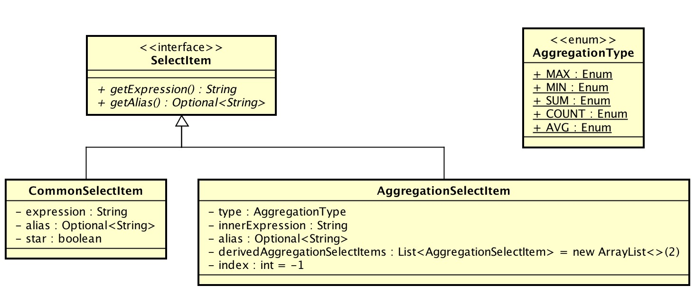

title: Sharding-JDBC 源码分析 —— SQL 解析（二）之插入SQL
date: 2017-07-25
tags:
categories: Sharding-JDBC
permalink: Sharding-JDBC/sql-parse-2

-------


> 🙂🙂🙂关注**微信公众号：【芋艿的后端小屋】**有福利：  
> 1. RocketMQ / MyCAT / Sharding-JDBC **所有**源码分析文章列表  
> 2. RocketMQ / MyCAT / Sharding-JDBC **中文注释源码 GitHub 地址**  
> 3. 您对于源码的疑问每条留言**都**将得到**认真**回复。**甚至不知道如何读源码也可以请教噢**。  
> 4. **新的**源码解析文章**实时**收到通知。**每周更新一篇左右**。

-------

-------

# 1. 概述

# 2. #query()

## 2.X #parseDistinct() 

解析 DISTINCT、DISTINCTROW、UNION 谓语。

核心代码：

```Java
// AbstractSelectParser.java
protected final void parseDistinct() {
   if (sqlParser.equalAny(DefaultKeyword.DISTINCT, DefaultKeyword.DISTINCTROW, DefaultKeyword.UNION)) {
       selectStatement.setDistinct(true);
       sqlParser.getLexer().nextToken();
       if (hasDistinctOn() && sqlParser.equalAny(DefaultKeyword.ON)) { // PostgreSQL 独有语法： DISTINCT ON
           sqlParser.getLexer().nextToken();
           sqlParser.skipParentheses();
       }
   } else if (sqlParser.equalAny(DefaultKeyword.ALL)) {
       sqlParser.getLexer().nextToken();
   }
}
```

此处的 DISTINCT 和我们常用的 DISTINCT(字段) 不同，它是针对查询结果做去重，即整行重复。举个例子：

```SQL
mysql> SELECT item_id, order_id FROM t_order_item;
+---------+----------+
| item_id | order_id |
+---------+----------+
| 1       | 1        |
| 1       | 1        |
+---------+----------+
2 rows in set (0.03 sec)

mysql> SELECT DISTINCT item_id, order_id FROM t_order_item;
+---------+----------+
| item_id | order_id |
+---------+----------+
| 1       | 1        |
+---------+----------+
1 rows in set (0.02 sec)
```

## 2.X #parseSelectList()

| SELECT | o.user_id  | COUNT(DISTINCT i.item_id) AS item_count | MAX(i.item_id) | FROM |
| --- | --- | --- | --- | --- |
|  | SelectItem | SelectItem | SelectItem |  |

将 SQL **查询字段** 按照**逗号( , )**切割成多个选择项( SelectItem)。核心代码如下：

```Java
// AbstractSelectParser.java
protected final void parseSelectList() {
   do {
       // 解析 选择项
       SelectItem selectItem = parseSelectItem();
       selectStatement.getItems().add(selectItem);
       // SELECT * 项
       if (selectItem instanceof CommonSelectItem && ((CommonSelectItem) selectItem).isStar()) {
           selectStatement.setContainStar(true);
       }
   } while (sqlParser.skipIfEqual(Symbol.COMMA));
   // 设置 最后一个查询项下一个 Token 的开始位置
   selectStatement.setSelectListLastPosition(sqlParser.getLexer().getCurrentToken().getEndPosition() - sqlParser.getLexer().getCurrentToken().getLiterals().length());
}
```

### 2.X.1 SelectItem 选择项

SelectItem 是一个接口，有 2 个实现类：

* CommonSelectItem ：通用选择项
* AggregationSelectItem ：聚合选择项



解析单个 SelectItem 核心代码：

```Java
// AbstractSelectParser.java
private SelectItem parseSelectItem() {
   // 第四种情况，SQL Server 独有
   if (isRowNumberSelectItem()) {
       return parseRowNumberSelectItem(selectStatement);
   }
   sqlParser.skipIfEqual(DefaultKeyword.CONNECT_BY_ROOT); // Oracle 独有：https://docs.oracle.com/cd/B19306_01/server.102/b14200/operators004.htm
   String literals = sqlParser.getLexer().getCurrentToken().getLiterals();
   // 第一种情况，* 通用选择项，SELECT *
   if (sqlParser.equalAny(Symbol.STAR) || Symbol.STAR.getLiterals().equals(SQLUtil.getExactlyValue(literals))) {
       sqlParser.getLexer().nextToken();
       return new CommonSelectItem(Symbol.STAR.getLiterals(), sqlParser.parseAlias(), true);
   }
   // 第二种情况，聚合选择项
   if (sqlParser.skipIfEqual(DefaultKeyword.MAX, DefaultKeyword.MIN, DefaultKeyword.SUM, DefaultKeyword.AVG, DefaultKeyword.COUNT)) {
       return new AggregationSelectItem(AggregationType.valueOf(literals.toUpperCase()), sqlParser.skipParentheses(), sqlParser.parseAlias());
   }
   // 第三种情况，非 * 通用选择项
   StringBuilder expression = new StringBuilder();
   Token lastToken = null;
   while (!sqlParser.equalAny(DefaultKeyword.AS) && !sqlParser.equalAny(Symbol.COMMA) && !sqlParser.equalAny(DefaultKeyword.FROM) && !sqlParser.equalAny(Assist.END)) {
       String value = sqlParser.getLexer().getCurrentToken().getLiterals();
       int position = sqlParser.getLexer().getCurrentToken().getEndPosition() - value.length();
       expression.append(value);
       lastToken = sqlParser.getLexer().getCurrentToken();
       sqlParser.getLexer().nextToken();
       if (sqlParser.equalAny(Symbol.DOT)) {
           selectStatement.getSqlTokens().add(new TableToken(position, value));
       }
   }
   // 不带 AS，并且有别名，并且别名不等于自己（tips：这里重点看。判断这么复杂的原因：防止substring操作截取结果错误）
   if (null != lastToken && Literals.IDENTIFIER == lastToken.getType()
           && !isSQLPropertyExpression(expression, lastToken) // 过滤掉，别名是自己的情况【1】（例如，SELECT u.user_id u.user_id FROM t_user）
           && !expression.toString().equals(lastToken.getLiterals())) { // 过滤掉，无别名的情况【2】（例如，SELECT user_id FROM t_user）
       return new CommonSelectItem(SQLUtil.getExactlyValue(expression.substring(0, expression.lastIndexOf(lastToken.getLiterals()))), Optional.of(lastToken.getLiterals()), false);
   }
   // 带 AS（例如，SELECT user_id AS userId） 或者 无别名（例如，SELECT user_id）
   return new CommonSelectItem(SQLUtil.getExactlyValue(expression.toString()), sqlParser.parseAlias(), false); // TODO 疑问：去掉特殊的原因
}
```

一共分成 4 种大的情况，我们来逐条梳理。

#### 2.X.1.1 第一种情况：* 通用选择项

例如，`SELECT * FROM t_user`。

为什么要加 `Symbol.STAR.getLiterals().equals(SQLUtil.getExactlyValue(literals))` 判断呢？

```SQL
SELECT `*` FROM t_user; // 也能达到查询所有字段的效果
```

#### 2.X.1.2 第二种情况：聚合选择项

例如，`SELECT COUNT(user_id) FROM t_user`。

获得聚合项里的内容，核心代码见：

```Java
// AbstractParser.java
/**
* 跳过小括号内所有的词法标记.
*
* @return 小括号内所有的词法标记
*/
public final String skipParentheses() {
   StringBuilder result = new StringBuilder("");
   int count = 0;
   if (Symbol.LEFT_PAREN == getLexer().getCurrentToken().getType()) {
       final int beginPosition = getLexer().getCurrentToken().getEndPosition();
       result.append(Symbol.LEFT_PAREN.getLiterals());
       getLexer().nextToken();
       while (true) {
           if (equalAny(Symbol.QUESTION)) {
               increaseParametersIndex();
           }
           // 到达结尾 或者 匹配合适数的)右括号
           if (Assist.END == getLexer().getCurrentToken().getType() || (Symbol.RIGHT_PAREN == getLexer().getCurrentToken().getType() && 0 == count)) {
               break;
           }
           // 处理里面有多个括号的情况，例如：SELECT COUNT(DISTINCT(order_id) FROM t_order
           if (Symbol.LEFT_PAREN == getLexer().getCurrentToken().getType()) {
               count++;
           } else if (Symbol.RIGHT_PAREN == getLexer().getCurrentToken().getType()) {
               count--;
           }
           // 下一个词法
           getLexer().nextToken();
       }
       // 获得括号内的内容
       result.append(getLexer().getInput().substring(beginPosition, getLexer().getCurrentToken().getEndPosition()));
       // 下一个词法
       getLexer().nextToken();
   }
   return result.toString();
}
```

#### 2.X.1.3 第三种情况：非 * 通用选择项

例如，`SELECT user_id FROM t_user`。

从实现上，逻辑会复杂很多。第一种，可以根据 `*` 做字段判断；第二种，可以使用 `(` 和 `)` 做字段判断。能够判断一个**包含别名的** SelectItem 结束有 4 种 Token，根据结束方式我们分成 2 种：

* DefaultKeyword.AS ：能够接触出 SelectItem 表达式，**即不包含别名**。例如，`SELECT user_id AS uid FROM t_user`，能够直接解析出 `user_id`。
* Symbol.COMMA / DefaultKeyword.FROM / Assist.END ：**包含别名**。例如，`SELECT user_id uid FROM t_user`，解析结果为 `user_id uid`。

基于这个在配合上面的代码注释，大家再重新理解下怎么解析第三种情况。

#### 2.X.1.4 第四种情况：SQLServer ROW_NUMBER

ROW_NUMBER 是 SQLServer 独有的。由于本文大部分的读者使用的 MySQL / Oracle，就不分析了。有兴趣的同学可以看 [SQLServerSelectParser#parseRowNumberSelectItem()](https://github.com/dangdangdotcom/sharding-jdbc/blob/9354031743b63e44cbded5618980ae71a15f0260/sharding-jdbc-core/src/main/java/com/dangdang/ddframe/rdb/sharding/parsing/parser/dialect/sqlserver/SQLServerSelectParser.java) 方法。

### 2.X.2 #parseAlias() 解析别名

解析别名，分成是否带 `AS` 两种情况。解析代码：

```Java
/**
* 解析别名.
*
* @return 别名
*/
public Optional<String> parseAlias() {
   // 解析带 AS 情况
   if (skipIfEqual(DefaultKeyword.AS)) {
       if (equalAny(Symbol.values())) {
           return Optional.absent();
       }
       String result = SQLUtil.getExactlyValue(getLexer().getCurrentToken().getLiterals());
       getLexer().nextToken();
       return Optional.of(result);
   }
   // 解析别名
   // TODO 增加哪些数据库识别哪些关键字作为别名的配置
   if (equalAny(Literals.IDENTIFIER, Literals.CHARS, DefaultKeyword.USER, DefaultKeyword.END, DefaultKeyword.CASE, DefaultKeyword.KEY, DefaultKeyword.INTERVAL, DefaultKeyword.CONSTRAINT)) {
       String result = SQLUtil.getExactlyValue(getLexer().getCurrentToken().getLiterals());
       getLexer().nextToken();
       return Optional.of(result);
   }
   return Optional.absent();
}
```

## 2.X #parseFrom()

解析单个表名和表别名。

### 2.X.1 JOIN ON / FROM TABLE

先抛开**子查询**的情况，只考虑如下两种 SQL 情况。

```SQL
// JOIN ON ： 实际可以继续 JOIN ON 更多表
SELECT * FROM t_order o JOIN t_order_item i ON o.order_id = i.order_id; 
// FROM 多表 ：实际可以继续 FROM 多更表
SELECT * FROM t_order o, t_order_item i 
```

在看实现代码之前，先一起看下调用顺序图：


看懂上图后，来继续看下实现代码：

```Java
/**
* 解析所有表名和表别名
*/
public final void parseFrom() {
   if (sqlParser.skipIfEqual(DefaultKeyword.FROM)) {
       parseTable();
   }
}

/**
* 解析所有表名和表别名
*/
public void parseTable() {
   // 解析子查询
   if (sqlParser.skipIfEqual(Symbol.LEFT_PAREN)) {
       if (!selectStatement.getTables().isEmpty()) {
           throw new UnsupportedOperationException("Cannot support subquery for nested tables.");
       }
       selectStatement.setContainStar(false);
       // 去掉子查询左括号
       sqlParser.skipUselessParentheses();
       // 解析子查询 SQL
       parse();
       // 去掉子查询右括号
       sqlParser.skipUselessParentheses();
       if (!selectStatement.getTables().isEmpty()) {
           return;
       }
   }
   // 解析当前表
   parseTableFactor();
   // 解析下一个表
   parseJoinTable();
}

/**
* 解析单个表名和表别名
*/
protected final void parseTableFactor() {
   int beginPosition = sqlParser.getLexer().getCurrentToken().getEndPosition() - sqlParser.getLexer().getCurrentToken().getLiterals().length();
   String literals = sqlParser.getLexer().getCurrentToken().getLiterals();
   sqlParser.getLexer().nextToken();
   // TODO 包含Schema解析
   if (sqlParser.skipIfEqual(Symbol.DOT)) { // TODO 待读
       sqlParser.getLexer().nextToken();
       sqlParser.parseAlias();
       return;
   }
   // FIXME 根据shardingRule过滤table
   selectStatement.getSqlTokens().add(new TableToken(beginPosition, literals));
   // 表 以及 表别名
   selectStatement.getTables().add(new Table(SQLUtil.getExactlyValue(literals), sqlParser.parseAlias()));
}

/**
* 解析 Join Table 或者 FROM 下一张 Table
*
*/
protected void parseJoinTable() {
   if (sqlParser.skipJoin()) {
       parseTable();
       if (sqlParser.skipIfEqual(DefaultKeyword.ON)) { // JOIN 表时 ON 条件
           do {
               parseTableCondition(sqlParser.getLexer().getCurrentToken().getEndPosition());
               sqlParser.accept(Symbol.EQ);
               parseTableCondition(sqlParser.getLexer().getCurrentToken().getEndPosition() - sqlParser.getLexer().getCurrentToken().getLiterals().length());
           } while (sqlParser.skipIfEqual(DefaultKeyword.AND));
       } else if (sqlParser.skipIfEqual(DefaultKeyword.USING)) { // JOIN 表时 USING 为使用两表相同字段相同时对 ON 的简化。例如以下两条 SQL 等价：
                                                                   // SELECT * FROM t_order o JOIN t_order_item i USING (order_id);
                                                                   // SELECT * FROM t_order o JOIN t_order_item i ON o.order_id = i.order_id
           sqlParser.skipParentheses();
       }
       parseJoinTable(); // TODO 疑问：这里为啥要 parseJoinTable
   }
}
    
private void parseTableCondition(final int startPosition) {
   SQLExpression sqlExpression = sqlParser.parseExpression();
   if (!(sqlExpression instanceof SQLPropertyExpression)) {
       return;
   }
   SQLPropertyExpression sqlPropertyExpression = (SQLPropertyExpression) sqlExpression;
   if (selectStatement.getTables().getTableNames().contains(SQLUtil.getExactlyValue(sqlPropertyExpression.getOwner().getName()))) {
       selectStatement.getSqlTokens().add(new TableToken(startPosition, sqlPropertyExpression.getOwner().getName()));
   }
}
```

OK，递归因为平时日常中写的比较少，可能理解起来可能会困难一些，努力看懂！🙂**如果真的看不懂，可以加微信公众号（芋艿的后端小屋），我来帮你一起理解。**

### 2.X.2 子查询

Sharding-JDBC 目前支持**第一个**包含多层级的数据子查询。例如：

```SQL
SELECT o3.* FROM (SELECT * FROM (SELECT * FROM t_order o) o2) o3;
SELECT o3.* FROM (SELECT * FROM (SELECT * FROM t_order o) o2) o3 JOIN t_order_item i ON o3.order_id = i.order_id;
```

不支持**第二个开始**包含多层级的数据子查询。例如：

```SQL
SELECT o3.* FROM (SELECT * FROM (SELECT * FROM t_order o) o2) o3 JOIN t_order_item i ON o3.order_id = i.order_id; // 此条 SQL 是上面第二条 SQL 左右量表颠倒
SELECT COUNT(*) FROM (SELECT * FROM t_order o WHERE o.id IN (SELECT id FROM t_order WHERE status = ?)) // FROM 官方不支持 SQL 举例
```

// TODO 此块内容有点问题

分页及子查询：http://dangdangdotcom.github.io/sharding-jdbc/02-guide/subquery/

## 2.X.3 #parseWhere()

解析 WHERE 查询条件。目前支持 AND 条件，不支持 OR 条件。近期 OR 条件支持的可能性比较低。

## 2.X.4 #

# 3. #parseOrderBy()

# 4. #customizedSelect()

# 5. #appendDerivedColumns()

# 6. #appendDerivedOrderBy()

# 7. 彩蛋


