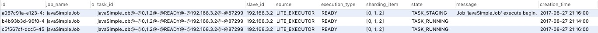
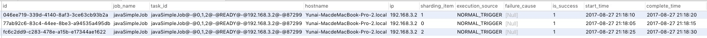

title: Elastic-Job-Lite 源码分析 —— 作业事件追踪【编辑中】
date: 2017-11-14
tags:
categories: Elastic-Job
permalink: Elastic-Job/job-event-trace

-------


> 🙂🙂🙂关注**微信公众号：【芋道源码】**有福利：  
> 1. RocketMQ / MyCAT / Sharding-JDBC **所有**源码分析文章列表  
> 2. RocketMQ / MyCAT / Sharding-JDBC **中文注释源码 GitHub 地址**  
> 3. 您对于源码的疑问每条留言**都**将得到**认真**回复。**甚至不知道如何读源码也可以请教噢**。  
> 4. **新的**源码解析文章**实时**收到通知。**每周更新一篇左右**。  
> 5. **认真的**源码交流微信群。

-------

# 1. 概述

本文主要分享 **Elastic-Job-Lite 作业事件追踪**。

Elastic-Job 提供了事件追踪功能，可通过事件订阅的方式处理调度过程的重要事件，用于查询、统计和监控。Elastic-Job 目前订阅两种事件，基于**关系型数据库**记录事件。

涉及到主要类的类图如下( [打开大图](http://www.yunai.me/images/Elastic-Job/2017_11_14/01.png) )：


* 以上类在 `com.dangdang.ddframe.job.event` 包，不仅为 Elastic-Job-Lite，而且为 Elastic-Job-Cloud 实现了事件追踪功能。
* 作业**事件**：粉色的类。
* 作业**事件总线**：黄色的类。
* 作业**事件监听器**：蓝色的类。 

> 你行好事会因为得到赞赏而愉悦  
> 同理，开源项目贡献者会因为 Star 而更加有动力  
> 为 Elastic-Job 点赞！[传送门](https://github.com/dangdangdotcom/elastic-job/stargazers)

# 2. 作业事件总线

JobEventBus，作业事件总线，提供了注册监听器、发布事件两个方法。

**创建** JobEventBus 代码如下：

```Java
public final class JobEventBus {

    /**
     * 作业事件配置
     */
    private final JobEventConfiguration jobEventConfig;
    /**
     * 线程池执行服务对象
     */
    private final ExecutorServiceObject executorServiceObject;
    /**
     * 事件总线
     */
    private final EventBus eventBus;
    /**
     * 是否注册作业监听器
     */
    private boolean isRegistered;
    
    public JobEventBus() {
        jobEventConfig = null;
        executorServiceObject = null;
        eventBus = null;
    }
    
    public JobEventBus(final JobEventConfiguration jobEventConfig) {
        this.jobEventConfig = jobEventConfig;
        executorServiceObject = new ExecutorServiceObject("job-event", Runtime.getRuntime().availableProcessors() * 2);
        // 创建 异步事件总线
        eventBus = new AsyncEventBus(executorServiceObject.createExecutorService());
        // 注册 事件监听器
        register();
    }
}
```

* JobEventBus 基于 [Google Guava EventBus](https://github.com/google/guava/wiki/EventBusExplained)，在[《Sharding-JDBC 源码分析 —— SQL 执行》「4.1 EventBus」](http://www.yunai.me/Sharding-JDBC/sql-execute)有详细分享。这里要注意的是 AsyncEventBus( **异步事件总线** )，注册在其上面的监听器是**异步**监听执行，不会同步阻塞事件发布。
* 使用 JobEventConfiguration( 作业事件配置 ) 创建事件监听器，调用 `#register()` 方法进行注册监听。

    ```Java
    private void register() {
       try {
           eventBus.register(jobEventConfig.createJobEventListener());
           isRegistered = true;
       } catch (final JobEventListenerConfigurationException ex) {
           log.error("Elastic job: create JobEventListener failure, error is: ", ex);
       }
    }
    ```
    * 该方法是私有( `private` )方法，只能使用 JobEventConfiguration 创建事件监听器注册。当不传递该配置时，意味着不开启**事件追踪**功能。


**发布作业事件**

发布作业事件( JobEvent ) 代码如下：

```Java
// JobEventBus.java
public void post(final JobEvent event) {
   if (isRegistered && !executorServiceObject.isShutdown()) {
       eventBus.post(event);
   }
}
```

# 3. 作业事件

目前有两种作业事件( JobEvent )：

* JobStatusTraceEvent，作业状态追踪事件。
* JobExecutionEvent，作业执行追踪事件。

本小节分享两方面：

* 作业事件**发布时机**。
* Elastic-Job 基于**关系型数据库**记录事件的**表结构**。

## 3.1 作业状态追踪事件

JobStatusTraceEvent，作业状态追踪事件。

代码如下：

```Java
public final class JobStatusTraceEvent implements JobEvent {

    /**
     * 主键
     */
    private String id = UUID.randomUUID().toString();
    /**
     * 作业名称
     */
    private final String jobName;
    /**
     * 原作业任务ID
     */
    @Setter
    private String originalTaskId = "";
    /**
     * 作业任务ID
     * 来自 {@link com.dangdang.ddframe.job.executor.ShardingContexts#taskId}
     */
    private final String taskId;
    /**
     * 执行作业服务器的名字
     * Elastic-Job-Lite，作业节点的 IP 地址
     * Elastic-Job-Cloud，Mesos 执行机主键
     */
    private final String slaveId;
    /**
     * 任务来源
     */
    private final Source source;
    /**
     * 任务执行类型
     */
    private final ExecutionType executionType;
    /**
     * 作业分片项
     * 多个分片项以逗号分隔
     */
    private final String shardingItems;
    /**
     * 任务执行状态
     */
    private final State state;
    /**
     * 相关信息
     */
    private final String message;
    /**
     * 记录创建时间
     */
    private Date creationTime = new Date();
}
```

* ExecutionType，执行类型。

    ```Java
    public enum ExecutionType {
        
        /**
         * 准备执行的任务.
         */
        READY,
        
        /**
         * 失效转移的任务.
         */
        FAILOVER
    }
    ```
* Source，任务来源。

    ```Java
    public enum Source {
       /**
        * Elastic-Job-Cloud 调度器
        */
       CLOUD_SCHEDULER,
       /**
        * Elastic-Job-Cloud 执行器
        */
       CLOUD_EXECUTOR,
       /**
        * Elastic-Job-Lite 执行器
        */
       LITE_EXECUTOR
    }
    ```
* State，任务执行状态。

    ```Java
    public enum State {
       /**
        * 开始中
        */
       TASK_STAGING,
       /**
        * 运行中
        */
       TASK_RUNNING,
       /**
        * 完成（正常）
        */
       TASK_FINISHED,
       /**
        * 完成（异常）
        */
       TASK_ERROR,
           
       TASK_KILLED, TASK_LOST, TASK_FAILED,  TASK_DROPPED, TASK_GONE, TASK_GONE_BY_OPERATOR, TASK_UNREACHABLE, TASK_UNKNOWN
    }
    ```
    * Elastic-Job-Lite 只有 TASK_STAGING、TASK_RUNNING、TASK_FINISHED、TASK_ERROR 四种执行状态。
    * Elastic-Job-Cloud 有所有的执行状态。

关系数据库表 `JOB_STATUS_TRACE_LOG` 结构如下：

```SQL
CREATE TABLE `JOB_STATUS_TRACE_LOG` (
  `id` varchar(40) COLLATE utf8_bin NOT NULL,
  `job_name` varchar(100) COLLATE utf8_bin NOT NULL,
  `original_task_id` varchar(255) COLLATE utf8_bin NOT NULL,
  `task_id` varchar(255) COLLATE utf8_bin NOT NULL,
  `slave_id` varchar(50) COLLATE utf8_bin NOT NULL,
  `source` varchar(50) COLLATE utf8_bin NOT NULL,
  `execution_type` varchar(20) COLLATE utf8_bin NOT NULL,
  `sharding_item` varchar(100) COLLATE utf8_bin NOT NULL,
  `state` varchar(20) COLLATE utf8_bin NOT NULL,
  `message` varchar(4000) COLLATE utf8_bin DEFAULT NULL,
  `creation_time` timestamp NULL DEFAULT NULL,
  PRIMARY KEY (`id`),
  KEY `TASK_ID_STATE_INDEX` (`task_id`,`state`)
) ENGINE=InnoDB DEFAULT CHARSET=utf8 COLLATE=utf8_bin
```

* Elastic-Job-Lite 一次作业执行记录如下：

    

JobStatusTraceEvent 在 Elastic-Job-Lite 发布时机：

* State.TASK_STAGING：

    ```Java
    // AbstractElasticJobExecutor.java
    public final void execute() {
        // ... 省略无关代码
        // 发布作业状态追踪事件(State.TASK_STAGING)
        if (shardingContexts.isAllowSendJobEvent()) {
            jobFacade.postJobStatusTraceEvent(shardingContexts.getTaskId(), State.TASK_STAGING, String.format("Job '%s' execute begin.", jobName));
        }
        // ... 省略无关代码
    }
    ```
* State.TASK_FINISHED：

    ```Java
    // AbstractElasticJobExecutor.java
    private void execute(final ShardingContexts shardingContexts, final JobExecutionEvent.ExecutionSource executionSource) {
       // ... 省略无关代码
       // 发布作业状态追踪事件(State.TASK_RUNNING)
       if (shardingContexts.isAllowSendJobEvent()) {
           jobFacade.postJobStatusTraceEvent(taskId, State.TASK_RUNNING, "");
       }
       // ... 省略无关代码
    }
    ```

* State.TASK_FINISHED、State.TASK_ERROR：

    ```Java
    // AbstractElasticJobExecutor.java
    public final void execute() {
        // ... 省略无关代码
        // 跳过 存在运行中的被错过作业
        if (jobFacade.misfireIfRunning(shardingContexts.getShardingItemParameters().keySet())) {
          // 发布作业状态追踪事件(State.TASK_FINISHED)
          if (shardingContexts.isAllowSendJobEvent()) {
              jobFacade.postJobStatusTraceEvent(shardingContexts.getTaskId(), State.TASK_FINISHED, String.format(
                      "Previous job '%s' - shardingItems '%s' is still running, misfired job will start after previous job completed.", jobName, 
                      shardingContexts.getShardingItemParameters().keySet()));
          }
          return;
        }
    }
    ```
    
    或者
    
    ```Java
    // AbstractElasticJobExecutor.java
    private void execute(final ShardingContexts shardingContexts, final JobExecutionEvent.ExecutionSource executionSource) {
       // ... 省略无关代码
       try {
           process(shardingContexts, executionSource);
       } finally {
           // ... 省略无关代码
           // 根据是否有异常，发布作业状态追踪事件(State.TASK_FINISHED / State.TASK_ERROR)
           if (itemErrorMessages.isEmpty()) {
               if (shardingContexts.isAllowSendJobEvent()) {
                   jobFacade.postJobStatusTraceEvent(taskId, State.TASK_FINISHED, "");
               }
           } else {
               if (shardingContexts.isAllowSendJobEvent()) {
                   jobFacade.postJobStatusTraceEvent(taskId, State.TASK_ERROR, itemErrorMessages.toString());
               }
           }
       }
    }
    ```

## 3.2 作业执行追踪事件

JobExecutionEvent，作业执行追踪事件。

代码如下：

```Java
public final class JobExecutionEvent implements JobEvent {

    /**
     * 主键
     */
    private String id = UUID.randomUUID().toString();
    /**
     * 主机名称
     */
    private String hostname = IpUtils.getHostName();
    /**
     * IP
     */
    private String ip = IpUtils.getIp();
    /**
     * 作业任务ID
     */
    private final String taskId;
    /**
     * 作业名字
     */
    private final String jobName;
    /**
     * 执行来源
     */
    private final ExecutionSource source;
    /**
     * 作业分片项
     */
    private final int shardingItem;
    /**
     * 开始时间
     */
    private Date startTime = new Date();
    /**
     * 结束时间
     */
    @Setter
    private Date completeTime;
    /**
     * 是否执行成功
     */
    @Setter
    private boolean success;
    /**
     * 执行失败原因
     */
    @Setter
    private JobExecutionEventThrowable failureCause;
}
```

* ExecutionSource，执行来源

    ```Java
    public enum ExecutionSource {
       /**
        * 普通触发执行
        */
       NORMAL_TRIGGER,
       /**
        * 被错过执行
        */
       MISFIRE,
       /**
        * 失效转移执行
        */
       FAILOVER
    }
    ```

关系数据库表 `JOB_EXECUTION_LOG` 结构如下：

```SQL
CREATE TABLE `JOB_EXECUTION_LOG` (
  `id` varchar(40) COLLATE utf8_bin NOT NULL,
  `job_name` varchar(100) COLLATE utf8_bin NOT NULL,
  `task_id` varchar(255) COLLATE utf8_bin NOT NULL,
  `hostname` varchar(255) COLLATE utf8_bin NOT NULL,
  `ip` varchar(50) COLLATE utf8_bin NOT NULL,
  `sharding_item` int(11) NOT NULL,
  `execution_source` varchar(20) COLLATE utf8_bin NOT NULL,
  `failure_cause` varchar(4000) COLLATE utf8_bin DEFAULT NULL,
  `is_success` int(11) NOT NULL,
  `start_time` timestamp NULL DEFAULT NULL,
  `complete_time` timestamp NULL DEFAULT NULL,
  PRIMARY KEY (`id`)
) ENGINE=InnoDB DEFAULT CHARSET=utf8 COLLATE=utf8_bin
```

* Elastic-Job-Lite 一次作业**多作业分片项**执行记录如下：

    

JobExecutionEvent 在 Elastic-Job-Lite 发布时机：

    ```Java
    private void process(final ShardingContexts shardingContexts, final int item, final JobExecutionEvent startEvent) {
       // 发布执行事件(开始)
       if (shardingContexts.isAllowSendJobEvent()) {
           jobFacade.postJobExecutionEvent(startEvent);
       }
       JobExecutionEvent completeEvent;
       try {
           // 执行单个作业
           process(new ShardingContext(shardingContexts, item));
           // 发布执行事件(成功)
           completeEvent = startEvent.executionSuccess();
           if (shardingContexts.isAllowSendJobEvent()) {
               jobFacade.postJobExecutionEvent(completeEvent);
           }
       } catch (final Throwable cause) {
           // 发布执行事件(失败)
           completeEvent = startEvent.executionFailure(cause);
           jobFacade.postJobExecutionEvent(completeEvent);
           // ... 省略无关代码
       }
    }
    ```

# 4. 

