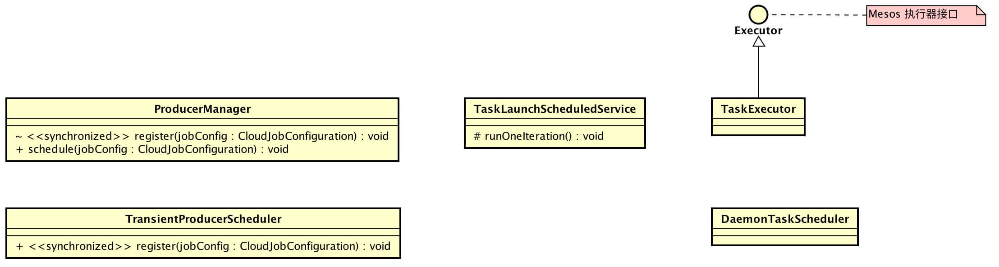
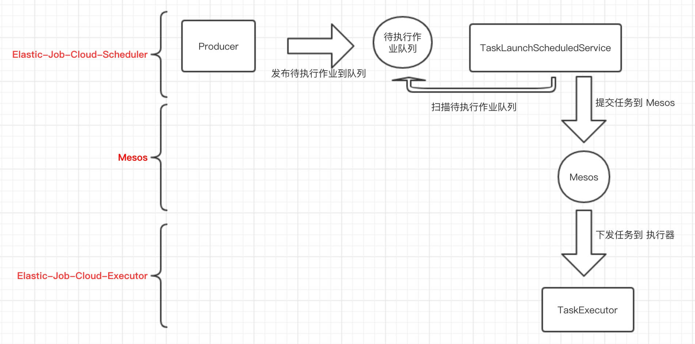

title: Elastic-Job-Cloud 源码分析 —— 作业配置
date: 2017-12-14
tags:
categories: Elastic-Job-Cloud
permalink: Elastic-Job/cloud-job-scheduler-and-executor

-------

**本文基于 Elastic-Job V2.1.5 版本分享**

TODO

-------


> 🙂🙂🙂关注**微信公众号：【芋道源码】**有福利：  
> 1. RocketMQ / MyCAT / Sharding-JDBC **所有**源码分析文章列表  
> 2. RocketMQ / MyCAT / Sharding-JDBC **中文注释源码 GitHub 地址**  
> 3. 您对于源码的疑问每条留言**都**将得到**认真**回复。**甚至不知道如何读源码也可以请教噢**。  
> 4. **新的**源码解析文章**实时**收到通知。**每周更新一篇左右**。  
> 5. **认真的**源码交流微信群。

-------

# 1. 概述

本文主要分享 **Elastic-Job-Cloud 调度**。对应到 Elastic-Job-Lite 源码解析文章如下：

* [《Elastic-Job-Lite 源码分析 —— 作业初始化》](http://www.yunai.me/Elastic-Job/job-init/?self)
* [《Elastic-Job-Lite 源码分析 —— 作业执行》](http://www.yunai.me/Elastic-Job/job-execute/?self)
* [《Elastic-Job-Lite 源码分析 —— 作业分片》](http://www.yunai.me/Elastic-Job/job-sharding/)

如果你阅读过以下文章，有助于对本文的理解：

* [《基于Mesos的当当作业云Elastic Job Cloud》](http://www.infoq.com/cn/news/2016/09/Mesos-Elastic-Job-Cloud)
* [《由浅入深 | 如何优雅地写一个Mesos Framework》](https://segmentfault.com/a/1190000007723430)

😈 另外，笔者假设你已经对 **[《Elastic-Job-Lite 源码分析系列》](../../../categories/Elastic-Job/?self)** 有一定的了解。

本文涉及到主体类的类图如下( [打开大图](../../../images/Elastic-Job/2017_12_21/01.png) )：



> 你行好事会因为得到赞赏而愉悦  
> 同理，开源项目贡献者会因为 Star 而更加有动力  
> 为 Elastic-Job 点赞！[传送门](https://github.com/dangdangdotcom/elastic-job/stargazers)

# 2. 作业执行类型

在 Elastic-Job-Cloud，作业执行分成两种类型：

* 常驻作业

> 常驻作业是作业一旦启动，无论运行与否均占用系统资源；  
> 常驻作业适合初始化时间长、触发间隔短、实时性要求高的作业，要求资源配备充足。

* 瞬时作业

> 瞬时作业是在作业启动时占用资源，运行完成后释放资源。  
> 瞬时作业适合初始化时间短、触发间隔长、允许延迟的作业，一般用于资源不太充分，或作业要求的资源多，适合资源错峰使用的场景。

Elastic-Job-Cloud 不同于 Elastic-Job-Lite 去中心化执行调度，转变为 **Mesos Framework 的中心节点调度**。这里不太理解，没关系，下文看到具体代码就能明白了。

常驻作业、瞬时作业在调度中会略有不同，大体**粗略**流程如下：



下面，我们针对每个过程一节一节解析。

# 3. Producer 发布任务

在上文[《Elastic-Job-Cloud 源码分析 —— 作业配置》的「3.1.1 操作云作业配置」](http://www.yunai.me/Elastic-Job/cloud-job-config/?self)可以看到添加云作业配置后，Elastic-Job-Cloud-Scheduler 会执行**作业调度**，实现代码如下：

```Java
// ProducerManager.java
/**
* 调度作业.
* 
* @param jobConfig 作业配置
*/
public void schedule(final CloudJobConfiguration jobConfig) {
   // 应用 或 作业 被禁用，不调度
   if (disableAppService.isDisabled(jobConfig.getAppName()) || disableJobService.isDisabled(jobConfig.getJobName())) {
       return;
   }
   if (CloudJobExecutionType.TRANSIENT == jobConfig.getJobExecutionType()) { // 瞬时作业
       transientProducerScheduler.register(jobConfig);
   } else if (CloudJobExecutionType.DAEMON == jobConfig.getJobExecutionType()) { // 常驻作业
       readyService.addDaemon(jobConfig.getJobName());
   }
}
```

* 瞬时作业和常驻作业在调度上会有一定的不同。

## 3.1 常驻作业

常驻作业在调度时，直接添加到待执行作业队列。What？岂不是马上就运行了！No No No，答案在「5. TaskExecutor 执行任务」，这里先打住。

```Java
// ReadyService.java
/**
* 将常驻作业放入待执行队列.
*
* @param jobName 作业名称
*/
public void addDaemon(final String jobName) {
   if (regCenter.getNumChildren(ReadyNode.ROOT) > env.getFrameworkConfiguration().getJobStateQueueSize()) {
       log.warn("Cannot add daemon job, caused by read state queue size is larger than {}.", env.getFrameworkConfiguration().getJobStateQueueSize());
       return;
   }
   Optional<CloudJobConfiguration> cloudJobConfig = configService.load(jobName);
   if (!cloudJobConfig.isPresent() || CloudJobExecutionType.DAEMON != cloudJobConfig.get().getJobExecutionType() || runningService.isJobRunning(jobName)) {
       return;
   }
   // 添加到待执行队列
   regCenter.persist(ReadyNode.getReadyJobNodePath(jobName), "1");
}

// ReadyNode.java
final class ReadyNode {
    
    static final String ROOT = StateNode.ROOT + "/ready";
    
    private static final String READY_JOB = ROOT + "/%s"; // %s = ${JOB_NAME}
}
```

* ReadyService，待执行作业队列服务，提供对待执行作业队列的各种操作方法。
* **待执行作业队列**存储在注册中心( Zookeeper )的**持久**数据节点 `/${NAMESPACE}/state/ready/${JOB_NAME}`，存储值为待执行次数。例如此处，待执行次数为 `1`。使用 zkClient 查看如下：

    ```shell
    [zk: localhost:2181(CONNECTED) 4] ls /elastic-job-cloud/state/ready
    [test_job_simple]
    [zk: localhost:2181(CONNECTED) 5] get /elastic-job-cloud/state/ready/test_job_simple
    1
    ```
    * 从官方的 RoadMap 来看，**待执行作业队列**未来会使用 Redis 存储以提高性能。

    > FROM http://elasticjob.io/docs/elastic-job-cloud/03-design/roadmap/  
    > Redis Based Queue Improvement

## 3.2 瞬时作业

瞬时作业在调度时，使用**发布瞬时作业任务的调度器**( TransientProducerScheduler )调度作业。当瞬时作业到达作业执行时间，添加到待执行作业队列。

### 3.2.1 TransientProducerScheduler

TransientProducerScheduler，发布瞬时作业任务的调度器，基于 Quartz 实现对瞬时作业的调度。初始化代码如下：

```Java
// TransientProducerScheduler.java
void start() {
   scheduler = getScheduler();
   try {
       scheduler.start();
   } catch (final SchedulerException ex) {
       throw new JobSystemException(ex);
   }
}

private Scheduler getScheduler() {
   StdSchedulerFactory factory = new StdSchedulerFactory();
   try {
       factory.initialize(getQuartzProperties());
       return factory.getScheduler();
   } catch (final SchedulerException ex) {
       throw new JobSystemException(ex);
   }
}
    
private Properties getQuartzProperties() {
   Properties result = new Properties();
   result.put("org.quartz.threadPool.class", SimpleThreadPool.class.getName());
   result.put("org.quartz.threadPool.threadCount", Integer.toString(Runtime.getRuntime().availableProcessors() * 2)); // 线程池数量
   result.put("org.quartz.scheduler.instanceName", "ELASTIC_JOB_CLOUD_TRANSIENT_PRODUCER");
   result.put("org.quartz.plugin.shutdownhook.class", ShutdownHookPlugin.class.getName());
   result.put("org.quartz.plugin.shutdownhook.cleanShutdown", Boolean.TRUE.toString());
   return result;
}
```

### 3.2.2 注册瞬时作业

调用 `TransientProducerScheduler#register(...)` 方法，注册顺序作业。实现代码如下：

```Java
// TransientProducerScheduler.java
private final TransientProducerRepository repository;

synchronized void register(final CloudJobConfiguration jobConfig) {
   String cron = jobConfig.getTypeConfig().getCoreConfig().getCron();
   // 添加 cron 作业集合
   JobKey jobKey = buildJobKey(cron);
   repository.put(jobKey, jobConfig.getJobName());
   // 调度 作业
   try {
       if (!scheduler.checkExists(jobKey)) {
           scheduler.scheduleJob(buildJobDetail(jobKey), buildTrigger(jobKey.getName()));
       }
   } catch (final SchedulerException ex) {
       throw new JobSystemException(ex);
   }
}
```

* 调用 `#buildJobKey(...)` 方法，创建 Quartz JobKey。你会发现很有意思的使用的是 `cron` 参数作为主键。Why？在看下 `!scheduler.checkExists(jobKey)` 处，相同 JobKey( `cron` ) 的作业不重复注册到 Quartz Scheduler。Why？此处是一个优化，相同 `cron` 使用同一个 Quartz Job，Elastic-Job-Cloud-Scheduler 可能会注册大量的瞬时作业，如果一个瞬时作业创建一个 Quartz Job 太过浪费，特别是 `cron` 每分钟、每5分钟、每小时、每天已经覆盖了大量的瞬时作业的情况。因此，相同 `cron` 使用同一个 Quartz Job。
* 调用 `TransientProducerRepository#put(...)` 以 Quartz JobKey 为主键聚合作业。

    ```Java
    final class TransientProducerRepository {
    
        /**
         * cron 作业集合
         * key：作业Key
         */
        private final ConcurrentHashMap<JobKey, List<String>> cronTasks = new ConcurrentHashMap<>(256, 1);
        
        synchronized void put(final JobKey jobKey, final String jobName) {
            remove(jobName);
            List<String> taskList = cronTasks.get(jobKey);
            if (null == taskList) {
                taskList = new CopyOnWriteArrayList<>();
                taskList.add(jobName);
                cronTasks.put(jobKey, taskList);
                return;
            }
            if (!taskList.contains(jobName)) {
                taskList.add(jobName);
            }
        }
    }
    ```
* 调用 `#buildJobDetail(...)` 创建 Quartz Job信息。

    ```Java
    private JobDetail buildJobDetail(final JobKey jobKey) {
        JobDetail result = JobBuilder.newJob(ProducerJob.class) // ProducerJob.java
                .withIdentity(jobKey).build();
        result.getJobDataMap().put("repository", repository);
        result.getJobDataMap().put("readyService", readyService);
        return result;
    }
    ```
    * `JobBuilder#newJob(...)` 的参数是 ProducerJob，下文会讲解到。

* 调用 `#buildTrigger(...)` 创建 Quartz Trigger。

    ```Java
    private Trigger buildTrigger(final String cron) {
       return TriggerBuilder.newTrigger()
               .withIdentity(cron)
               .withSchedule(CronScheduleBuilder.cronSchedule(cron) // cron
               .withMisfireHandlingInstructionDoNothing())
               .build();
    }
    ```

### 3.2.3 ProducerJob

ProducerJob，当 Quartz Job 到达 `cron` 执行时间( 即作业执行时间)，将相应的瞬时作业添加到待执行作业队列。实现代码如下：

```Java
public static final class ProducerJob implements Job {
        
   private TransientProducerRepository repository;
   
   private ReadyService readyService;
   
   @Override
   public void execute(final JobExecutionContext context) throws JobExecutionException {
       List<String> jobNames = repository.get(context.getJobDetail().getKey());
       for (String each : jobNames) {
           readyService.addTransient(each);
       }
   }
}
```

* 调用 `TransientProducerRepository#get(...)` 方法，获得该 Job 对应的作业集合。

    ```Java
    final class TransientProducerRepository {
    
        /**
         * cron 作业集合
         * key：作业Key
         */
        private final ConcurrentHashMap<JobKey, List<String>> cronTasks = new ConcurrentHashMap<>(256, 1);
        
        List<String> get(final JobKey jobKey) {
            List<String> result = cronTasks.get(jobKey);
            return null == result ? Collections.<String>emptyList() : result;
        }
    }
    ```

* 调用 `ReadyService#addTransient(...)` 方法，添加瞬时作业到待执行作业队列。

    ```Java
    /**
    * 将瞬时作业放入待执行队列.
    * 
    * @param jobName 作业名称
    */
    public void addTransient(final String jobName) {
       //
       if (regCenter.getNumChildren(ReadyNode.ROOT) > env.getFrameworkConfiguration().getJobStateQueueSize()) {
           log.warn("Cannot add transient job, caused by read state queue size is larger than {}.", env.getFrameworkConfiguration().getJobStateQueueSize());
           return;
       }
       //
       Optional<CloudJobConfiguration> cloudJobConfig = configService.load(jobName);
       if (!cloudJobConfig.isPresent() || CloudJobExecutionType.TRANSIENT != cloudJobConfig.get().getJobExecutionType()) {
           return;
       }
       // 
       String readyJobNode = ReadyNode.getReadyJobNodePath(jobName);
       String times = regCenter.getDirectly(readyJobNode);
       if (cloudJobConfig.get().getTypeConfig().getCoreConfig().isMisfire()) {
           regCenter.persist(readyJobNode, Integer.toString(null == times ? 1 : Integer.parseInt(times) + 1));
       } else {
           regCenter.persist(ReadyNode.getReadyJobNodePath(jobName), "1");
       }
    }
    ```
    * **添加瞬时作业到待执行作业队列** 和 **添加常驻作业到待执行作业队列**基本是一致的。
    * TODO :misfire

## 3.3 小结

无论是常驻作业还是瞬时作业，都会加入到**待执行作业队列**。目前我们看到瞬时作业的每次调度是 TransientProducerScheduler 负责。那么常驻作业的每次调度呢？「5. TaskExecutor 执行任务」会看到它的调度，这是 Elastic-Job-Cloud 设计巧妙有趣的地方。

# 4. TaskLaunchScheduledService 提交任务


# 5. TaskExecutor 执行任务

# 666. 彩蛋

