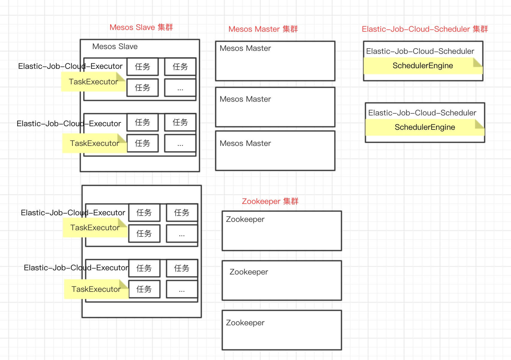

title: Elastic-Job-Cloud 源码分析 —— 高可用【编辑中】
date: 2018-01-15
tags:
categories: Elastic-Job-Cloud
permalink: Elastic-Job/cloud-high-availability

-------

**本文基于 Elastic-Job V2.1.5 版本分享**

-------


> 🙂🙂🙂关注**微信公众号：【芋道源码】**有福利：  
> 1. RocketMQ / MyCAT / Sharding-JDBC **所有**源码分析文章列表  
> 2. RocketMQ / MyCAT / Sharding-JDBC **中文注释源码 GitHub 地址**  
> 3. 您对于源码的疑问每条留言**都**将得到**认真**回复。**甚至不知道如何读源码也可以请教噢**。  
> 4. **新的**源码解析文章**实时**收到通知。**每周更新一篇左右**。  
> 5. **认真的**源码交流微信群。

-------

# 1. 概述

本文主要分享 **Elastic-Job-Cloud 高可用**。

一个高可用的 Elastic-Job-Cloud 组成如下图：



* Mesos Master 集群
* Mesos Slave 集群
* Zookeeper 集群
* Elastic-Job-Cloud-Scheduler 集群
* Elastic-Job-Cloud-Executor 集群

**本文重点分享 Elastic-Job-Cloud-Scheduler 如何实现高可用。**

Mesos Master / Mesos Slave / Zookeeper 高可用，同学们可以自行 Google 解决。Elastic-Job-Cloud-Executor 运行在 Mesos Slave 上，通过 Mesos Slave 集群多节点实现高可用。

> 你行好事会因为得到赞赏而愉悦  
> 同理，开源项目贡献者会因为 Star 而更加有动力  
> 为 Elastic-Job 点赞！[传送门](https://github.com/dangdangdotcom/elastic-job/stargazers)

# 2. Scheduler 集群

Elastic-Job-Cloud-Scheduler 通过至少两个节点实现集群。**集群中通过主节点选举一个主节点，只有主节点提供服务，从实例处于"待命"状态。当主节点故障时，从节点会选举出新的主节点继续提供服务。**实现代码如下：

```Java
public final class Bootstrap {
    
    public static void main(final String[] args) throws InterruptedException {
        // 初始化 注册中心
        CoordinatorRegistryCenter regCenter = new ZookeeperRegistryCenter(BootstrapEnvironment.getInstance().getZookeeperConfiguration());
        regCenter.init();
        // 初始化 Zookeeper 选举服务
        final ZookeeperElectionService electionService = new ZookeeperElectionService(
                BootstrapEnvironment.getInstance().getFrameworkHostPort(), (CuratorFramework) regCenter.getRawClient(), HANode.ELECTION_NODE, new SchedulerElectionCandidate(regCenter));
        electionService.start();
        // 挂起 主进程
        final CountDownLatch latch = new CountDownLatch(1);
        latch.await();
        // Hook TODO 貌似位置不对？
        Runtime.getRuntime().addShutdownHook(new Thread("shutdown-hook") {
        
            @Override
            public void run() {
                electionService.stop();
                latch.countDown();
            }
        });
    }
}
```

* Bootstrap，Elastic-Job-Cloud-Scheduler 启动器（仿佛在说废话）。
* CoordinatorRegistryCenter，用于协调分布式服务的注册中心，在[《Elastic-Job-Lite 源码分析 —— 注册中心》](http://www.iocoder.cn/Elastic-Job/reg-center-zookeeper/?)有详细解析。
* ZookeeperElectionService，Zookeeper 选举服务，本小节的主角。

调用 `ZookeeperElectionService#start()` 方法，初始化 Zookeeper 选举服务以实现 Elastic-Job-Cloud-Scheduler 主节点选举。

```Java

private final CountDownLatch leaderLatch = new CountDownLatch(1);
    
private final LeaderSelector leaderSelector;

public ZookeeperElectionService(final String identity, final CuratorFramework client, final String electionPath, final ElectionCandidate electionCandidate) {
   // 创建 LeaderSelector
   leaderSelector = new LeaderSelector(client, electionPath, new LeaderSelectorListenerAdapter() {
       
       @Override
       public void takeLeadership(final CuratorFramework client) throws Exception {
           // ... 省略【暂时】无关代码
       }
   });
   // 设置重复参与选举主节点
   leaderSelector.autoRequeue();
   // 设置参与节点的编号
   leaderSelector.setId(identity);
}

/**
* 开始选举.
*/
public void start() {
   log.debug("Elastic job: {} start to elect leadership", leaderSelector.getId());
   leaderSelector.start();
}
```

* 通过 [Apache Curator LeaderSelector](https://curator.apache.org/apidocs/org/apache/curator/framework/recipes/leader/LeaderSelector.html) 实现分布式多节点选举。

    > FROM https://curator.apache.org/apidocs/org/apache/curator/framework/recipes/leader/LeaderSelector.html  
    > Abstraction to select a "leader" amongst multiple contenders in a group of JMVs connected to a Zookeeper cluster. If a group of N thread/processes contends for leadership, one will be assigned leader until it releases leadership at which time another one from the group will be chosen.  
    > Note that this class uses an underlying InterProcessMutex and as a result leader election is "fair" - each user will become leader in the order originally requested (from ZK's point of view).
    
* 调用 `LeaderSelector#autoRequeue()` 方法，设置重复参与选举主节点。默认情况下，自己选举成为主节点后，不再参与下次选举。设置重复参与选举主节点后，每次选举都会参与。在 Elastic-Job-Cloud-Scheduler 里，我们显然要重复参与选举。
* 调用 `LeaderSelector#setId()` 方法，设置参与节点的编号。在 Elastic-Job-Cloud-Scheduler 里暂时没有实际用途。编号算法为 `BootstrapEnvironment.getInstance().getFrameworkHostPort()`，即：`HOST:PORT`。
* 调用 `#start()` 方法，开始选举。**当自己选举主节点成功**，回调 `LeaderSelector#takeLeadership()` 方法。

回调 `LeaderSelector#takeLeadership()` 方法，Elastic-Job-Cloud-Scheduler **主节点开始领导状态**。实现代码如下：

```Java
// ZookeeperElectionService.LeaderSelector 内部实现类
@Override
public void takeLeadership(final CuratorFramework client) throws Exception {
    log.info("Elastic job: {} has leadership", identity);
    try {
        // 开始领导状态
        electionCandidate.startLeadership();
        // 挂起 进程
        leaderLatch.await();
        log.warn("Elastic job: {} lost leadership.", identity);
        // 终止领导状态
        electionCandidate.stopLeadership();
    } catch (final JobSystemException exception) {
        // 异常退出
        log.error("Elastic job: Starting error", exception);
        System.exit(1);  
    }
}
```

* 调用 `SchedulerElectionCandidate#startLeadership()` 方法，开始领导状态。实现代码如下：

    ```Java
    // SchedulerElectionCandidate.java
    public final class SchedulerElectionCandidate implements ElectionCandidate {
        
        private final CoordinatorRegistryCenter regCenter;
        
        private SchedulerService schedulerService;
        
        public SchedulerElectionCandidate(final CoordinatorRegistryCenter regCenter) {
            this.regCenter = regCenter;
        }
        
        @Override
        public void startLeadership() throws Exception {
            try {
                schedulerService = new SchedulerService(regCenter);
                schedulerService.start();
            } catch (final Throwable throwable) {
                throw new JobSystemException(throwable);
            }
        }
    }
    
    // SchedulerService.java
    /**
    * 以守护进程方式启动.
    */
    public void start() {
       facadeService.start();
       producerManager.startup();
       statisticManager.startup();
       cloudJobConfigurationListener.start();
       taskLaunchScheduledService.startAsync();
       restfulService.start();
       schedulerDriver.start();
       if (env.getFrameworkConfiguration().isEnabledReconcile()) {
           reconcileService.startAsync();
       }
    }
    ```
    * 当 Elastic-Job-Cloud-Scheduler **主节点**调用 `SchedulerService#start()` 方法后，各种服务初始化完成，特别是和 Mesos Master 的连接，可以愉快的进行作业调度等等服务。
    * Elastic-Job-Cloud-Scheduler **从节点**，因为无法回调 `LeaderSelector#takeLeadership()` 方法，处于"待命"状态。当主节点故障时，从节点会选举出新的主节点，触发 `LeaderSelector#takeLeadership()` 方法回调，继续提供服务。

* 调用 `CountLatch#await()` 方法，挂起**主节点** `LeaderSelector#takeLeadership()` 方法继续向下执行。为什么要进行挂起？如果调用完该方法，**主节点**就会让出**主节点**身份，这样会导致 Elastic-Job-Cloud-Scheduler 集群不断不断不断更新主节点，无法正常提供服务。
* 当 Elastic-Job-Cloud-Scheduler **主节点**关闭时，触发上文代码看到的 ShutdownHook ，关闭服务。实现代码如下：

    ```Java
    // Bootstrap.java
    public final class Bootstrap {
    
        public static void main(final String[] args) throws InterruptedException {
            // ... 省略无关代码
            Runtime.getRuntime().addShutdownHook(new Thread("shutdown-hook") {
            
                @Override
                public void run() {
                    // 停止选举
                    electionService.stop();
                    latch.countDown();
                }
            });
        }
    
    }
    ```
    * 调用 `ElectionService#stop()` 方法，停止选举，从而终止领导状态，关闭各种服务。实现代码如下：

        ```Java
        // ZookeeperElectionService.java
        public void stop() {
            log.info("Elastic job: stop leadership election");
            // 结束 #takeLeadership() 方法的进程挂起
            leaderLatch.countDown();
            try {
                // 关闭 LeaderSelector
                leaderSelector.close();
            } catch (final Exception ignored) {
            }
        }
        
        // SchedulerElectionCandidate.java
        @Override
        public void stopLeadership() {
            schedulerService.stop();
        }
        
        // SchedulerService.java
        /**
         * 停止运行.
         */
        public void stop() {
            restfulService.stop();
            taskLaunchScheduledService.stopAsync();
            cloudJobConfigurationListener.stop();
            statisticManager.shutdown();
            producerManager.shutdown();
            schedulerDriver.stop(true);
            facadeService.stop();
            if (env.getFrameworkConfiguration().isEnabledReconcile()) {
                reconcileService.stopAsync();
            }
        }
        ```

* 当发生 JobSystemException 异常时，即调用 `SchedulerElectionCandidate#startLeadership()` 方法发生异常( `SchedulerElectionCandidate#stopLeadership()` 实际不会抛出异常 )，调用 `System.exit(1)` 方法，Elastic-Job-Cloud-Scheduler 主节点**异常崩溃**。

# 3. Scheduler 部署

比较容易想到的一种方式，选择多台主机部署 Elastic-Job-Cloud-Executor 多个节点。

But...... 我们要想下，Elastic-Job-Cloud-Executor 运行在 Mesos 之上，可以使用上 Mesos 的资源调度和部署服务。引入 Mesos 上著名的框架 [Marathon](https://mesosphere.github.io/marathon/)。它可以带来**所有后台进程( 例如，Elastic-Job-Cloud-Executor )能够运行在任意机器上，Marathon 会在后台已有实例失败时，自动启动新实例**的好处。是不是很赞 +1024 ？！

> FROM [《Mesos 框架构建分布式应用》](http://product.dangdang.com/24187450.html) P47  
> Mesos 集群里的常见方案是在 Marathon 上运行集群的 Mesos 框架。但是 Marathon 本身就是一种 Mesos 的框架！那么在 Marathon 上运行 Mesos 框架意味着什么呢？不用考虑如何将每种框架的调度器部署到特定的主机上并且处理这些主机的故障，Marathon 能够确保框架的调度器总是在集群里的某处运行着。这样大幅简化了在高可用配置里部署新框架的复杂度。

嗯...... 当然，Marathon 我们也要做高可用。

😈 Marathon 原来中文是马拉松。哈哈哈，很适合的名字。

# 4. Scheduler 故障转移

# 5. Scheduler 数据存储

# 6. Mesos Master 崩溃

# 7. Mesos Slave 崩溃

# 8. Scheduler 核对

# 666. 彩蛋


