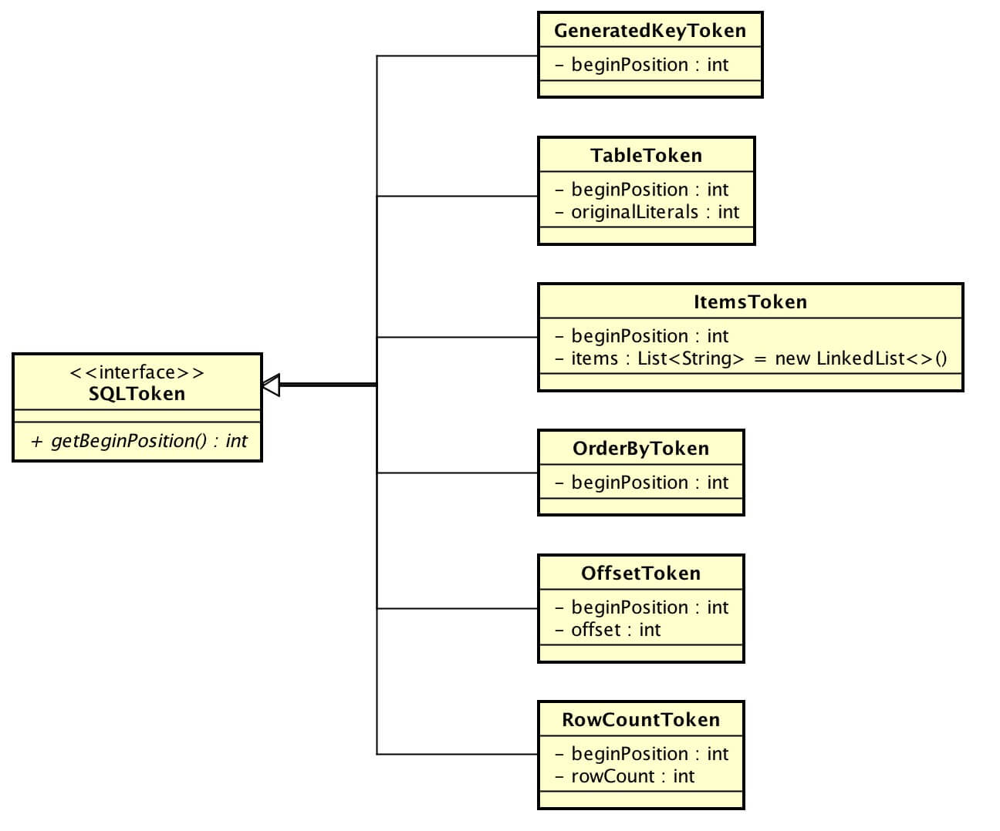
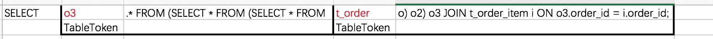
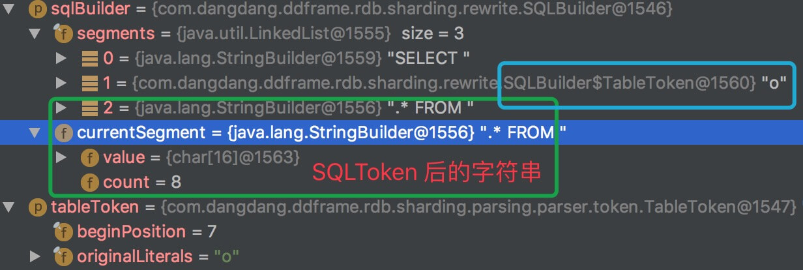
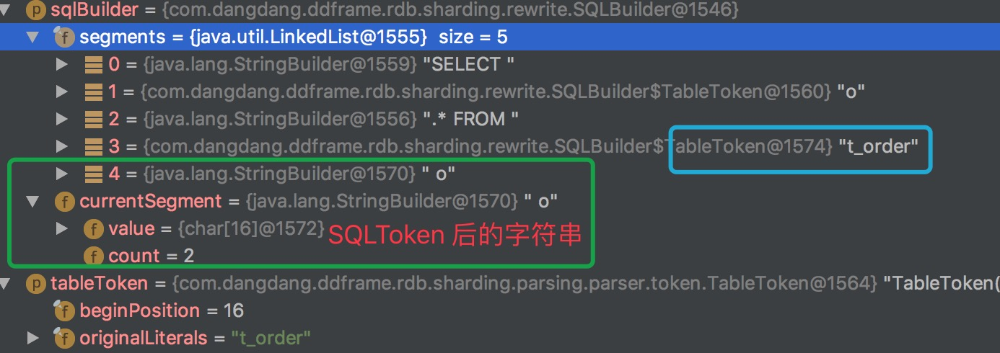
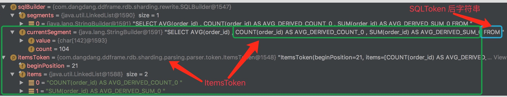
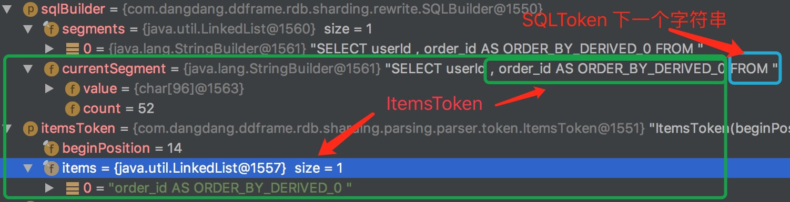
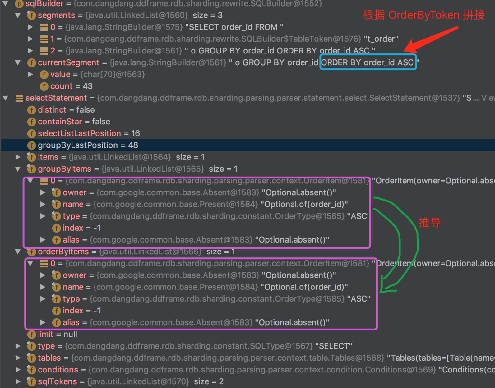

# 1. 概述

前置阅读：[《SQL 解析（三）之查询SQL》](http://www.yunai.me/Sharding-JDBC/sql-parse-3/?mp)

本文分享**SQL 改写**的源码实现。主要涉及两方面：

1. SQL 改写：改写 SQL，解决分库分表后，查询结果需要聚合，需要对 SQL 进行调整，例如分页
2. SQL 生成：生成分表分库的执行 SQL

SQLRewriteEngine，SQL重写引擎，实现 SQL 改写、生成功能。从 Sharding-JDBC 1.5.0 版本，SQL 改写进行了调整和大量优化。

> 1.4.x及之前版本，SQL改写是在SQL路由之前完成的，在1.5.x中调整为SQL路由之后，因为SQL改写可以根据路由至单库表还是多库表而进行进一步优化。

😆 很多同学看完[《SQL 解析-系列》](http://www.yunai.me/images/common/wechat_mp_2017_07_31.jpg) 可能是一脸懵逼，特别对**“SQL 半理解”**。希望本文能给你一些启发。

> **Sharding-JDBC 正在收集使用公司名单：[传送门](https://github.com/dangdangdotcom/sharding-jdbc/issues/234)。  
> 🙂 你的登记，会让更多人参与和使用 Sharding-JDBC。[传送门](https://github.com/dangdangdotcom/sharding-jdbc/issues/234)  
> Sharding-JDBC 也会因此，能够覆盖更多的业务场景。[传送门](https://github.com/dangdangdotcom/sharding-jdbc/issues/234)  
> 登记吧，骚年！[传送门](https://github.com/dangdangdotcom/sharding-jdbc/issues/234)**

# 2. SQLToken

😁 SQLToken 在本文中很重要，所以即使在[《SQL 解析-系列》](http://www.yunai.me/images/common/wechat_mp_2017_07_31.jpg)已经分享过，我们也换个姿势，再来一次。

SQLToken，SQL标记对象**接口**。SQLRewriteEngine 基于 SQLToken 实现 **SQL改写**。SQL解析器在 SQL解析过程中，很重要的一个目的是**标记需要SQL改写的部分**，也就是 SQLToken。



| 类 | 说明 | 生成条件
| :--- | :--- | :--- |
| GeneratedKeyToken | 自增主键标记对象   |  |
| TableToken        | 表标记对象        | 1. 查询列的表别名：`SELECT o.order_id` 的 `o` <br/> 2. 查询的表名：`SELECT * FROM t_order` 的 `t_order` |
| ItemsToken        | 选择项标记对象     | 1. AVG查询列：`SELECT AVG(price) FROM t_order` 的 `AVG(price)` <br/> 2. ORDER BY 字段不在查询列：`SELECT order_id FROM t_order ORDER BY create_time` 的 `create_time` <br/> 3. GROUP BY 字段不在查询列：`SELECT COUNT(order_id) FROM t_order GROUP BY user_id` 的 `user_id`  |
| OffsetToken       | 分页偏移量标记对象  | 分页有偏移量，但**不是**占位符 `?` |
| RowCountToken     | 分页长度标记对象    | 分页有长度，但**不是**占位符 `?` |
| OrderByToken      | 排序标记对象       | 有 GROUP BY 条件，无 ORDER BY 条件：`SELECT COUNT(*) FROM t_order GROUP BY order_id` 的 `order_id` |

# 3.SQL 改写

`SQLRewriteEngine#rewrite()` 实现了 **SQL改写** 功能。

```Java
// SQLRewriteEngine.java
/**
* SQL改写.
* @param isRewriteLimit 是否重写Limit
* @return SQL构建器
*/
public SQLBuilder rewrite(final boolean isRewriteLimit) {
   SQLBuilder result = new SQLBuilder();
   if (sqlTokens.isEmpty()) {
       result.appendLiterals(originalSQL);
       return result;
   }
   int count = 0;
   // 排序SQLToken，按照 beginPosition 递增
   sortByBeginPosition();
   for (SQLToken each : sqlTokens) {
       if (0 == count) { // 拼接第一个 SQLToken 前的字符串
           result.appendLiterals(originalSQL.substring(0, each.getBeginPosition()));
       }
       // 拼接每个SQLToken
       if (each instanceof TableToken) {
           appendTableToken(result, (TableToken) each, count, sqlTokens);
       } else if (each instanceof ItemsToken) {
           appendItemsToken(result, (ItemsToken) each, count, sqlTokens);
       } else if (each instanceof RowCountToken) {
           appendLimitRowCount(result, (RowCountToken) each, count, sqlTokens, isRewriteLimit);
       } else if (each instanceof OffsetToken) {
           appendLimitOffsetToken(result, (OffsetToken) each, count, sqlTokens, isRewriteLimit);
       } else if (each instanceof OrderByToken) {
           appendOrderByToken(result);
       }
       count++;
   }
   return result;
}
```

* SQL改写以 SQLToken 为**间隔**，**顺序**改写。
    * 顺序：调用 `#sortByBeginPosition()` 将 SQLToken 按照 `beginPosition` **升序**。
    * 间隔：遍历 SQLToken，逐个拼接。

例如：
    

-------

SQLBuilder，SQL构建器。下文会大量用到，我们看下实现代码。

``` Java
public final class SQLBuilder {

    /**
     * 段集合
     */
    private final List<Object> segments;
    /**
     * 当前段
     */
    private StringBuilder currentSegment;
    
    public SQLBuilder() {
        segments = new LinkedList<>();
        currentSegment = new StringBuilder();
        segments.add(currentSegment);
    }
    
    /**
     * 追加字面量.
     *
     * @param literals 字面量
     */
    public void appendLiterals(final String literals) {
        currentSegment.append(literals);
    }
    
    /**
     * 追加表占位符.
     *
     * @param tableName 表名称
     */
    public void appendTable(final String tableName) {
        // 添加 TableToken
        segments.add(new TableToken(tableName));
        // 新建当前段
        currentSegment = new StringBuilder();
        segments.add(currentSegment);
    }
    
    public String toSQL(final Map<String, String> tableTokens) {
        // ... 省略代码，【SQL生成】处分享
    }
    
    @RequiredArgsConstructor
    private class TableToken {
        /**
         * 表名
         */
        private final String tableName;
    }
}
```

-------

现在我们来逐个分析每种 SQLToken 的**拼接**实现。

## 3.1 TableToken

调用 `#appendTableToken()` 方法拼接。

```Java
// SQLRewriteEngine.java
/**
* 拼接 TableToken
*
* @param sqlBuilder SQL构建器
* @param tableToken tableToken
* @param count tableToken 在 sqlTokens 的顺序
* @param sqlTokens sqlTokens
*/
private void appendTableToken(final SQLBuilder sqlBuilder, final TableToken tableToken, final int count, final List<SQLToken> sqlTokens) {
   // 拼接 TableToken
   String tableName = sqlStatement.getTables().getTableNames().contains(tableToken.getTableName()) ? tableToken.getTableName() : tableToken.getOriginalLiterals();
   sqlBuilder.appendTable(tableName);
   // 拼接 SQLToken 后面的字符串
   int beginPosition = tableToken.getBeginPosition() + tableToken.getOriginalLiterals().length();
   int endPosition = sqlTokens.size() - 1 == count ? originalSQL.length() : sqlTokens.get(count + 1).getBeginPosition();
   sqlBuilder.appendLiterals(originalSQL.substring(beginPosition, endPosition));
}
```

* 调用 `SQLBuilder#appendTable()` 拼接 TableToken。
* `sqlStatement.getTables().getTableNames().contains(tableToken.getTableName())` 目的是处理掉**表名前后有的特殊字符**，例如`SELECT * FROM 't_order'` 中 `t_order` 前后有 `'` 符号。

```Java
// TableToken.java
/**
* 获取表名称.
*/
public String getTableName() {
   return SQLUtil.getExactlyValue(originalLiterals);
}

// SQLUtil.java
public static String getExactlyValue(final String value) {
   return null == value ? null : CharMatcher.anyOf("[]`'\"").removeFrom(value);
}
```

* 当 SQL 为 `SELECT o.* FROM t_order o`
    * TableToken 为查询列前的表别名 `o` 时返回结果：
        
    * TableToken 为表名 `t_order` 时返回结果：
        

## 3.2 ItemsToken

调用 `#appendItemsToken()` 方法拼接。

```Java
// SQLRewriteEngine.java
/**
* 拼接 TableToken
*
* @param sqlBuilder SQL构建器
* @param itemsToken itemsToken
* @param count itemsToken 在 sqlTokens 的顺序
* @param sqlTokens sqlTokens
*/
private void appendItemsToken(final SQLBuilder sqlBuilder, final ItemsToken itemsToken, final int count, final List<SQLToken> sqlTokens) {
   // 拼接 ItemsToken
   for (String item : itemsToken.getItems()) {
       sqlBuilder.appendLiterals(", ");
       sqlBuilder.appendLiterals(item);
   }
   // SQLToken 后面的字符串
   int beginPosition = itemsToken.getBeginPosition();
   int endPosition = sqlTokens.size() - 1 == count ? originalSQL.length() : sqlTokens.get(count + 1).getBeginPosition();
   sqlBuilder.appendLiterals(originalSQL.substring(beginPosition, endPosition));
}
```

* 第一种情况，**AVG查询列**，SQL 为 `SELECT AVG(order_id) FROM t_order o` 时返回结果：
  
* 第二种情况，**ORDER BY 字段不在查询列**，SQL 为 `SELECT userId FROM t_order o ORDER BY order_id` 时返回结果：
  
* 第三种情况，**GROUP BY 字段不在查询列**，类似第二种情况，就不举例子列。

## 3.3 OffsetToken

调用 `#appendLimitOffsetToken()` 方法拼接。

```Java
// SQLRewriteEngine.java
/**
* 拼接 OffsetToken
*
* @param sqlBuilder SQL构建器
* @param offsetToken offsetToken
* @param count offsetToken 在 sqlTokens 的顺序
* @param sqlTokens sqlTokens
* @param isRewrite 是否重写。当路由结果为单分片时无需重写
*/
private void appendLimitOffsetToken(final SQLBuilder sqlBuilder, final OffsetToken offsetToken, final int count, final List<SQLToken> sqlTokens, final boolean isRewrite) {
   // 拼接 OffsetToken
   sqlBuilder.appendLiterals(isRewrite ? "0" : String.valueOf(offsetToken.getOffset()));
   // SQLToken 后面的字符串
   int beginPosition = offsetToken.getBeginPosition() + String.valueOf(offsetToken.getOffset()).length();
   int endPosition = sqlTokens.size() - 1 == count ? originalSQL.length() : sqlTokens.get(count + 1).getBeginPosition();
   sqlBuilder.appendLiterals(originalSQL.substring(beginPosition, endPosition));
}
```

* 当分页**跨分片**时，需要每个分片都查询后在**内存**中进行聚合。此时 `isRewrite = true`。为什么是 `"0"` 开始呢？每个分片在 [0, offset) 的记录**可能**属于实际分页结果，因而查询每个分片需要从 0 开始。
* 当分页**单分片**时，则无需重写，该分片执行的结果即是最终结果。**SQL改写在SQL路由之后就有这个好处**。如果先改写，因为没办法知道最终是单分片还是跨分片，考虑正确性，只能统一使用跨分片。

## 3.4 RowCountToken

调用 `#appendLimitRowCount()` 方法拼接。

```Java
// SQLRewriteEngine.java
private void appendLimitRowCount(final SQLBuilder sqlBuilder, final RowCountToken rowCountToken, final int count, final List<SQLToken> sqlTokens, final boolean isRewrite) {
   SelectStatement selectStatement = (SelectStatement) sqlStatement;
   Limit limit = selectStatement.getLimit();
   if (!isRewrite) { // 路由结果为单分片
       sqlBuilder.appendLiterals(String.valueOf(rowCountToken.getRowCount()));
   } else if ((!selectStatement.getGroupByItems().isEmpty() || // [1.1] 跨分片分组需要在内存计算，可能需要全部加载
           !selectStatement.getAggregationSelectItems().isEmpty()) // [1.2] 跨分片聚合列需要在内存计算，可能需要全部加载
           && !selectStatement.isSameGroupByAndOrderByItems()) { // [2] 如果排序一致，即各分片已经排序好结果，就不需要全部加载
       sqlBuilder.appendLiterals(String.valueOf(Integer.MAX_VALUE));
   } else { // 路由结果为多分片
       sqlBuilder.appendLiterals(String.valueOf(limit.isRowCountRewriteFlag() ? rowCountToken.getRowCount() + limit.getOffsetValue() : rowCountToken.getRowCount()));
   }
   // SQLToken 后面的字符串
   int beginPosition = rowCountToken.getBeginPosition() + String.valueOf(rowCountToken.getRowCount()).length();
   int endPosition = sqlTokens.size() - 1 == count ? originalSQL.length() : sqlTokens.get(count + 1).getBeginPosition();
   sqlBuilder.appendLiterals(originalSQL.substring(beginPosition, endPosition));
}
```

* [1.1] `!selectStatement.getGroupByItems().isEmpty()` 跨分片**分组**需要在内存计算，**可能**需要全部加载。如果不全部加载，部分结果被分页条件错误结果，会导致结果不正确。
* [1.2] `!selectStatement.getAggregationSelectItems().isEmpty())` 跨分片**聚合列**需要在内存计算，**可能**需要全部加载。如果不全部加载，部分结果被分页条件错误结果，会导致结果不正确。😈该逻辑可以进一步性能优化，MAX / MIN / COUNT / SUM 在不 GROUP BY 的情况下，返回的是一条，**改成只判断 AVG 会更好**。
* [1.1][1.2]，**可能**变成必须的前提是 GROUP BY 和 ORDER BY 排序不一致。如果一致，各分片已经排序完成，无需内存中排序。

### 3.4.1 分页补充

OffsetToken、RowCountToken 只有在分页对应位置非占位符 `?` 才存在。当对应位置是占位符时，会对**分页条件对应的预编译 SQL 占位符参数**进行重写，**整体逻辑和 OffsetToken、RowCountToken 是一致的**。

```Java
// 👼 ParsingSQLRouter#route() 调用 #processLimit() 

// ParsingSQLRouter.java
/**
* 处理分页条件
*
* @see SQLRewriteEngine#appendLimitRowCount(SQLBuilder, RowCountToken, int, List, boolean) 
* @param parameters 占位符对应参数列表
* @param selectStatement Select SQL语句对象
* @param isSingleRouting 是否单表路由
*/
private void processLimit(final List<Object> parameters, final SelectStatement selectStatement, final boolean isSingleRouting) {
   boolean isNeedFetchAll = (!selectStatement.getGroupByItems().isEmpty() // // [1.1] 跨分片分组需要在内存计算，可能需要全部加载
                               || !selectStatement.getAggregationSelectItems().isEmpty()) // [1.2] 跨分片聚合列需要在内存计算，可能需要全部加载
                           && !selectStatement.isSameGroupByAndOrderByItems(); // [2] 如果排序一致，即各分片已经排序好结果，就不需要全部加载
   selectStatement.getLimit().processParameters(parameters, !isSingleRouting, isNeedFetchAll);
}

// Limit.java
/**
* 填充改写分页参数.
* @param parameters 参数
* @param isRewrite 是否重写参数
* @param isFetchAll 是否获取所有数据
*/
public void processParameters(final List<Object> parameters, final boolean isRewrite, final boolean isFetchAll) {
   fill(parameters);
   if (isRewrite) {
       rewrite(parameters, isFetchAll);
   }
}
/**
* 将占位符参数里是分页的参数赋值给 offset 、rowCount
* 赋值的前提条件是 offset、rowCount 是 占位符
* @param parameters 占位符参数
*/
private void fill(final List<Object> parameters) {
   int offset = 0;
   if (null != this.offset) {
       offset = -1 == this.offset.getIndex() ? getOffsetValue() : NumberUtil.roundHalfUp(parameters.get(this.offset.getIndex()));
       this.offset.setValue(offset);
   }
   int rowCount = 0;
   if (null != this.rowCount) {
       rowCount = -1 == this.rowCount.getIndex() ? getRowCountValue() : NumberUtil.roundHalfUp(parameters.get(this.rowCount.getIndex()));
       this.rowCount.setValue(rowCount);
   }
   if (offset < 0 || rowCount < 0) {
       throw new SQLParsingException("LIMIT offset and row count can not be a negative value.");
   }
}
/**
* 重写分页条件对应的参数
* @param parameters 参数
* @param isFetchAll 是否拉取所有
*/
private void rewrite(final List<Object> parameters, final boolean isFetchAll) {
   int rewriteOffset = 0;
   int rewriteRowCount;
   // 重写
   if (isFetchAll) {
       rewriteRowCount = Integer.MAX_VALUE;
   } else if (rowCountRewriteFlag) {
       rewriteRowCount = null == rowCount ? -1 : getOffsetValue() + rowCount.getValue();
   } else {
       rewriteRowCount = rowCount.getValue();
   }
   // 参数设置
   if (null != offset && offset.getIndex() > -1) {
       parameters.set(offset.getIndex(), rewriteOffset);
   }
   if (null != rowCount && rowCount.getIndex() > -1) {
       parameters.set(rowCount.getIndex(), rewriteRowCount);
   }
}
```

## 3.5 OrderByToken

调用 `#appendOrderByToken()` 方法拼接。数据库里，当无 ORDER BY条件 而有 GROUP BY 条件时候，会使用 GROUP BY条件将结果升序排序：

*  `SELECT order_id FROM t_order GROUP BY order_id` 等价于 `SELECT order_id FROM t_order GROUP BY order_id ORDER BY order_id ASC`
*  `SELECT order_id FROM t_order GROUP BY order_id DESC` 等价于 `SELECT order_id FROM t_order GROUP BY order_id ORDER BY order_id DESC`

```Java
// ParsingSQLRouter.java
/**
* 拼接 OrderByToken
*
* @param sqlBuilder SQL构建器
*/
private void appendOrderByToken(final SQLBuilder sqlBuilder) {
   SelectStatement selectStatement = (SelectStatement) sqlStatement;
   // 拼接 OrderByToken
   StringBuilder orderByLiterals = new StringBuilder(" ORDER BY ");
   int i = 0;
   for (OrderItem each : selectStatement.getOrderByItems()) {
       if (0 == i) {
           orderByLiterals.append(each.getColumnLabel()).append(" ").append(each.getType().name());
       } else {
           orderByLiterals.append(",").append(each.getColumnLabel()).append(" ").append(each.getType().name());
       }
       i++;
   }
   orderByLiterals.append(" ");
   sqlBuilder.appendLiterals(orderByLiterals.toString());
}
```

* 当 SQL 为 `SELECT order_id FROM t_order o GROUP BY order_id` 返回结果：
    

## 3.6 GeneratedKeyToken


# 4. SQL 生成


