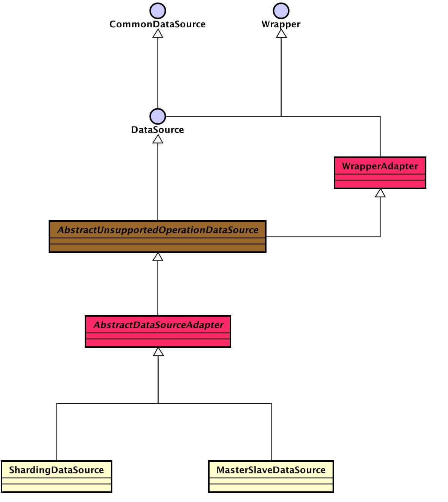
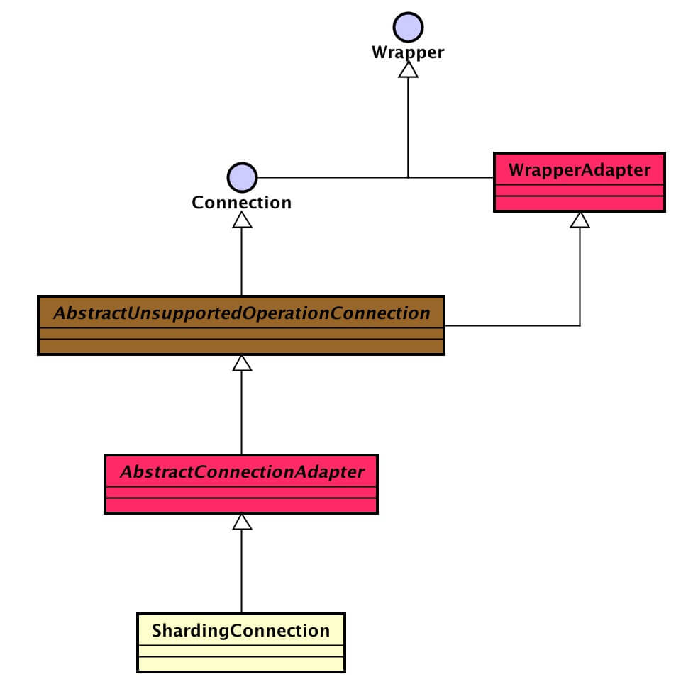
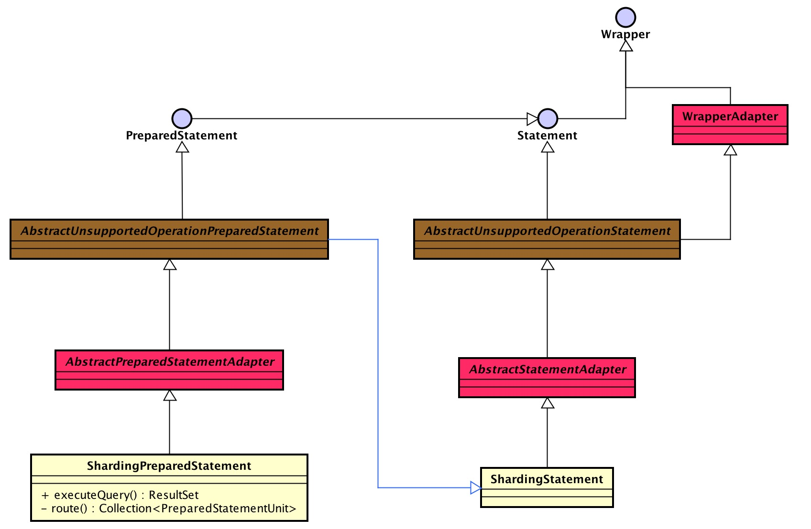
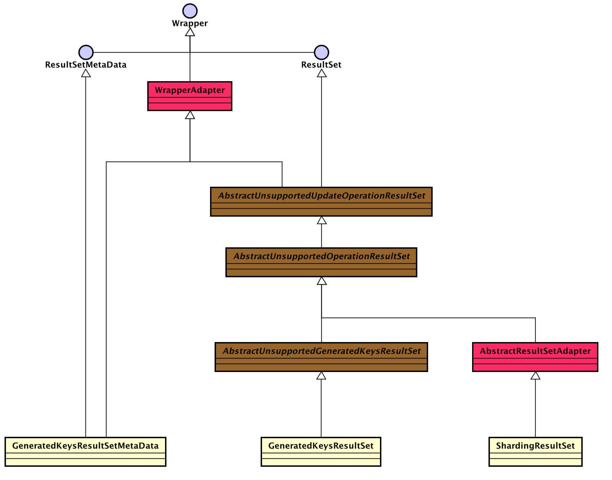

title: Sharding-JDBC 源码分析 —— JDBC 实现
date: 2017-08-18
tags:
categories: Sharding-JDBC
permalink: Sharding-JDBC/jdbc-implement-and-read-write-splitting

-------


> 🙂🙂🙂关注**微信公众号：【芋艿的后端小屋】**有福利：  
> 1. RocketMQ / MyCAT / Sharding-JDBC **所有**源码分析文章列表  
> 2. RocketMQ / MyCAT / Sharding-JDBC **中文注释源码 GitHub 地址**  
> 3. 您对于源码的疑问每条留言**都**将得到**认真**回复。**甚至不知道如何读源码也可以请教噢**。  
> 4. **新的**源码解析文章**实时**收到通知。**每周更新一篇左右**。  
> 5. **认真的**源码交流微信群。

-------

占坑文。关注公众号，第一时间获得更新通知。

-------

# 1. 概述

本文主要分享 **JDBC** 与 **读写分离** 的实现。为什么会把这两个东西放在一起讲呢？客户端直连数据库的读写分离主要通过获取读库和写库的不同连接来实现。

OK，我们先来看一段 Sharding-JDBC 官方对自己的定义和定位

> Sharding-JDBC定位为轻量级java框架，使用客户端直连数据库，以jar包形式提供服务，未使用中间层，无需额外部署，无其他依赖，DBA也无需改变原有的运维方式，可理解为**增强版的JDBC驱动**，旧代码迁移成本几乎为零。

可以看出，Sharding-JDBC 通过实现 **JDBC规范**，对上层提供透明化数据库分库分表的访问。😈 黑科技？实际我们使用的**数据库连接池**也是通过这种方式实现对上层无感知的使用连接池。甚至还可以通过这种方式实现对 Lucene、[MongoDB](http://www.yunai.me/MyCAT/connect-mongodb/?self) 等的访问。

扯远了，下面来看看 Sharding-JDBC `jdbc` 包的结构：


* `unsupported`：声明**不支持**的数据操作方法
* `adapter`：适配类，实现和分库分表**无关**的方法
* `core`：核心类，实现和分库分表**相关**的方法

根据 `core` 包，可以看出分成四种我们**超级熟悉**的四种对象  

* Datasource

    

* Connection

   

* Statement

  

* ResultSet

  

**实现**层级如下：**JDBC 接口** <=(继承)== **`unsupported`抽象类** <=(继承)== **`unsupported`抽象类** <=(继承)== **`core`类**。

-------

**本文内容顺序**

1. `unspported` 包
2. `adapter` 包
3. 插入流程，贯穿 JDBC 实现。涉及到的类：
    * ShardingDataSource
    * ShardingConnection
    * ShardingPreparedStatement（ShardingStatement 类似，不重复分析）
    * GeneratedKeysResultSet、GeneratedKeysResultSetMetaData、ShardingResultSet
4. 读写分离，主要 ShardingDataSource 类

-------

> **Sharding-JDBC 正在收集使用公司名单：[传送门](https://github.com/dangdangdotcom/sharding-jdbc/issues/234)。  
> 🙂 你的登记，会让更多人参与和使用 Sharding-JDBC。[传送门](https://github.com/dangdangdotcom/sharding-jdbc/issues/234)  
> Sharding-JDBC 也会因此，能够覆盖更多的业务场景。[传送门](https://github.com/dangdangdotcom/sharding-jdbc/issues/234)  
> 登记吧，骚年！[传送门](https://github.com/dangdangdotcom/sharding-jdbc/issues/234)**

# 2. unspported 包

`unspported` 包内的**抽象**类，声明不支持操作的数据对象，所有方法都是 `throw new SQLFeatureNotSupportedException()` 方式。

```Java
public abstract class AbstractUnsupportedGeneratedKeysResultSet extends AbstractUnsupportedOperationResultSet {
    
    @Override
    public boolean getBoolean(final int columnIndex) throws SQLException {
        throw new SQLFeatureNotSupportedException("getBoolean");
    }
    
    // .... 省略其它类似方法
}

public abstract class AbstractUnsupportedOperationConnection extends WrapperAdapter implements Connection {
    
    @Override
    public final CallableStatement prepareCall(final String sql) throws SQLException {
        throw new SQLFeatureNotSupportedException("prepareCall");
    }
    
   // .... 省略其它类似方法
}
```

# 3. adapter 包

`adapter` 包内的**抽象**类，实现和分库分表相关的方法。

## 3.1 WrapperAdapter

[WrapperAdapter](https://github.com/dangdangdotcom/sharding-jdbc/blob/d6ac50704f5e45beeeded09a4f0b160c7320b993/sharding-jdbc-core/src/main/java/com/dangdang/ddframe/rdb/sharding/jdbc/adapter/WrapperAdapter.java)，JDBC Wrapper 适配类。

**对 Wrapper 接口实现如下两个方法**：

```Java
@Override
public final <T> T unwrap(final Class<T> iface) throws SQLException {
   if (isWrapperFor(iface)) {
       return (T) this;
   }
   throw new SQLException(String.format("[%s] cannot be unwrapped as [%s]", getClass().getName(), iface.getName()));
}
    
@Override
public final boolean isWrapperFor(final Class<?> iface) throws SQLException {
   return iface.isInstance(this);
}
```

**提供子类 `#recordMethodInvocation()` 记录方法调用，`#replayMethodsInvocation()` 回放记录的方法调用**：

```Java

/**
* 记录的方法数组
*/
private final Collection<JdbcMethodInvocation> jdbcMethodInvocations = new ArrayList<>();

/**
* 记录方法调用.
* 
* @param targetClass 目标类
* @param methodName 方法名称
* @param argumentTypes 参数类型
* @param arguments 参数
*/
public final void recordMethodInvocation(final Class<?> targetClass, final String methodName, final Class<?>[] argumentTypes, final Object[] arguments) {
   try {
       jdbcMethodInvocations.add(new JdbcMethodInvocation(targetClass.getMethod(methodName, argumentTypes), arguments));
   } catch (final NoSuchMethodException ex) {
       throw new ShardingJdbcException(ex);
   }
}
    
/**
* 回放记录的方法调用.
* 
* @param target 目标对象
*/
public final void replayMethodsInvocation(final Object target) {
   for (JdbcMethodInvocation each : jdbcMethodInvocations) {
       each.invoke(target);
   }
}
```

* 这两个方法有什么用途呢？例如下文会提到的 AbstractConnectionAdapter 的 `#setAutoCommit()`，当它无数据库连接时，先记录；等到那到数据连接后，再回放：

    ```Java
    // AbstractConnectionAdapter.java
    @Override
    public final void setAutoCommit(final boolean autoCommit) throws SQLException {
       this.autoCommit = autoCommit;
       if (getConnections().isEmpty()) { // 无数据连接时，记录方法调用
           recordMethodInvocation(Connection.class, "setAutoCommit", new Class[] {boolean.class}, new Object[] {autoCommit});
           return;
       }
       for (Connection each : getConnections()) {
           each.setAutoCommit(autoCommit);
       }
    }
    ```
* JdbcMethodInvocation，反射调用JDBC相关方法的工具类：

    ```Java
    public class JdbcMethodInvocation {
    
        /**
         * 方法
         */
        @Getter
        private final Method method;
        /**
         * 方法参数
         */
        @Getter
        private final Object[] arguments;
        
        /**
         *  调用方法.
         * 
         * @param target 目标对象
         */
        public void invoke(final Object target) {
            try {
                method.invoke(target, arguments); // 反射调用
            } catch (final IllegalAccessException | InvocationTargetException ex) {
                throw new ShardingJdbcException("Invoke jdbc method exception", ex);
            }
        }
    }
    ```    

**提供子类 `#throwSQLExceptionIfNecessary()` 抛出异常链**：

```Java
protected void throwSQLExceptionIfNecessary(final Collection<SQLException> exceptions) throws SQLException {
   if (exceptions.isEmpty()) { // 为空不抛出异常
       return;
   }
   SQLException ex = new SQLException();
   for (SQLException each : exceptions) {
       ex.setNextException(each); // 异常链
   }
   throw ex;
}
```

# 4. 插入流程

# 5. 读写分离

> **Sharding-JDBC 正在收集使用公司名单：[传送门](https://github.com/dangdangdotcom/sharding-jdbc/issues/234)。  
> 🙂 你的登记，会让更多人参与和使用 Sharding-JDBC。[传送门](https://github.com/dangdangdotcom/sharding-jdbc/issues/234)  
> Sharding-JDBC 也会因此，能够覆盖更多的业务场景。[传送门](https://github.com/dangdangdotcom/sharding-jdbc/issues/234)  
> 登记吧，骚年！[传送门](https://github.com/dangdangdotcom/sharding-jdbc/issues/234)**

