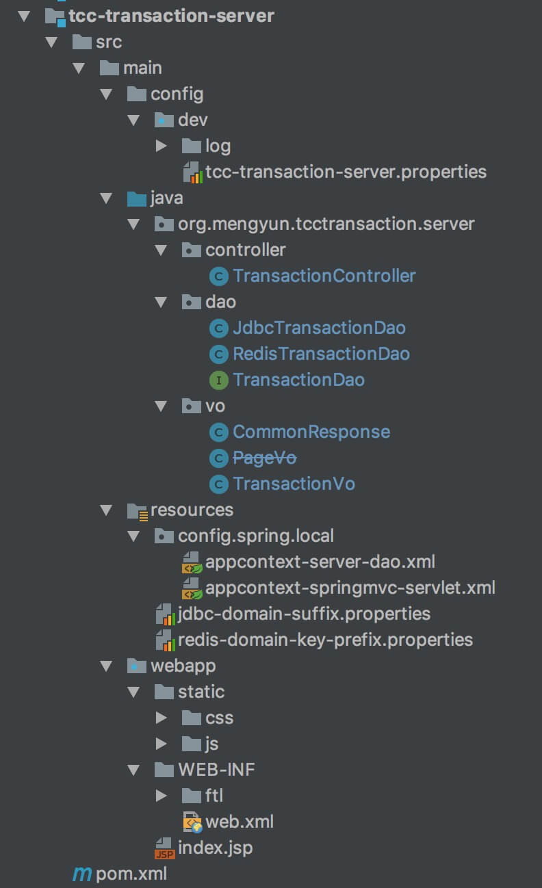
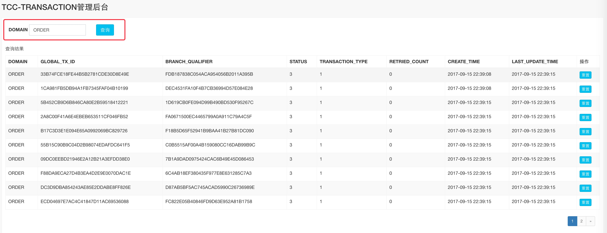
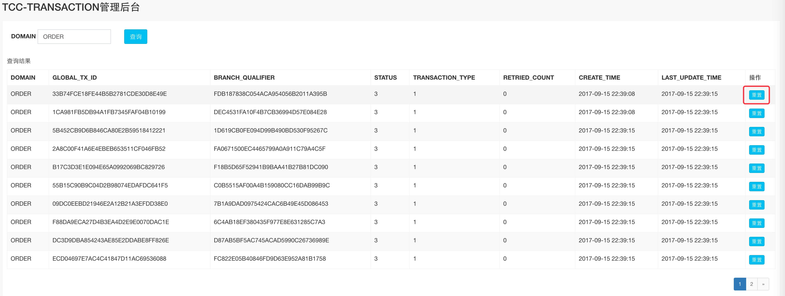

title: TCC-Transaction 源码分析 —— 运维平台
date: 2018-02-28
tags:
categories: TCC-Transaction
permalink: TCC-Transaction/console

---

---

---

# 1. 概述

本文分享 **运维平台**。TCC-Transaction 提供了相对精简的运维，用于查看在[《TCC-Transaction 源码分析 —— 事务存储器》](http://www.iocoder.cn/TCC-Transaction/transaction-repository/?self)提到的**事务存储**。目前只有两个功能：

* 查看未完成的事务列表
* 重置事务恢复重试次数

运维平台( Maven 项目 `tcc-transaction-server` ) 整体代码结构如下：



本文自下而上，Dao => Controller => UI 的顺序进行解析实现。

> 你行好事会因为得到赞赏而愉悦  
> 同理，开源项目贡献者会因为 Star 而更加有动力  
> 为 TCC-Transaction 点赞！[传送门](https://github.com/changmingxie/tcc-transaction)

ps：笔者假设你已经阅读过[《tcc-transaction 官方文档 —— 使用指南1.2.x》](https://github.com/changmingxie/tcc-transaction/wiki/%E4%BD%BF%E7%94%A8%E6%8C%87%E5%8D%971.2.x)。

# 2. 数据访问层

`org.mengyun.tcctransaction.server.dao.TransactionDao`，事务Dao **接口**，实现代码如下：

```Java
public interface TransactionDao {

    /**
     * 获得事务 VO 数组
     *
     * @param domain 领域
     * @param pageNum 第几页
     * @param pageSize 分页大小
     * @return 事务 VO 数组
     */
    List<TransactionVo> findTransactions(String domain, Integer pageNum, int pageSize);

    /**
     * 获得事务总数量
     *
     * @param domain 领域
     * @return 数量
     */
    Integer countOfFindTransactions(String domain);

    /**
     * 重置事务重试次数
     *
     * @param domain 领域
     * @param globalTxId 全局事务编号
     * @param branchQualifier 分支事务编号
     * @return 是否重置成功
     */
    boolean resetRetryCount(String domain, byte[] globalTxId, byte[] branchQualifier);
}
```

TCC-Transaction 提供了四种事务存储器，但是目前只支持两种数据访问层的实现：

* JDBC 事务 DAO
* Redis 事务 DAO

## 2.1 JDBC 事务 DAO

`org.mengyun.tcctransaction.server.dao.JdbcTransactionDao`，JDBC 事务 DAO 实现。实现代码如下：

```Java
@Repository("jdbcTransactionDao")
public class JdbcTransactionDao implements TransactionDao {

    private static final String TABLE_NAME_PREFIX = "TCC_TRANSACTION";

    @Autowired
    private DataSource dataSource;

    /**
     * 读取 jdbc-domain-suffix.properties
     */
    @Value("#{jdbcDomainSuffix}")
    private Properties domainSuffix;
    
    // ... 省略代码
}
```

* `dataSource`，数据源。配置方式如下：

    ```XML
    // appcontext-server-dao.xml 
    <bean id="dataSource"
         class="org.apache.commons.dbcp.BasicDataSource"
         destroy-method="close">
       <property name="driverClassName" value="com.mysql.jdbc.Driver"/>
       <property name="url" value="${jdbc.url}"/>
       <property name="username" value="${jdbc.username}"/>
       <property name="password" value="${jdbc.password}"/>
       <property name="maxActive" value="50"/>
       <property name="minIdle" value="5"/>
       <property name="maxIdle" value="20"/>
       <property name="initialSize" value="30"/>
       <property name="logAbandoned" value="true"/>
       <property name="removeAbandoned" value="true"/>
       <property name="removeAbandonedTimeout" value="10"/>
       <property name="maxWait" value="1000"/>
       <property name="timeBetweenEvictionRunsMillis" value="10000"/>
       <property name="numTestsPerEvictionRun" value="10"/>
       <property name="minEvictableIdleTimeMillis" value="10000"/>
       <property name="validationQuery" value="SELECT NOW() FROM DUAL"/>
    </bean>
    
    // tcc-transaction-server.properties
    jdbc.url=jdbc:mysql://127.0.0.1:33061/TCC?useUnicode=true&characterEncoding=UTF-8
    jdbc.username=root
    jdbc.password=123456
    ```
    * 在 `appcontext-server-dao.xml`，配置数据源 Bean 对象。
    * 在 `tcc-transaction-server.properties` 配置数据源属性。

* `domainSuffix`，domian 和 表后缀( `suffix` ) 的映射关系。配置方式如下：

    ```XML
    // jdbc-domain-suffix.properties
    CAPITAL=_CAP
    ORDER=_ORD
    REDPACKET=_RED
    ```
    * 键 ：domain。
    * 值 ：suffix。

// TODO 数据源
// TODO 代码注释

## 2.2 Redis 事务 DAO

`org.mengyun.tcctransaction.server.dao.RedisTransactionDao`，Redis 事务 DAO。实现代码如下：

```Java
@Repository("redisTransactionDao")
public class RedisTransactionDao implements TransactionDao {

    /**
     * redis pool
     */
    @Autowired
    private JedisPool jedisPool;

    /**
     * 序列化
     */
    private ObjectSerializer serializer = new JdkSerializationSerializer();

    /**
     * 读取 redis-domain-key-prefix.properties
     */
    @Value("#{redisDomainKeyPrefix}")
    private Properties domainKeyPrefix;
}
```

* `jedisPool`，Redis 连接池。配置方式如下：

    ```XML
    // appcontext-server-dao.xml
    <bean id="jedisPoolConfig" class="redis.clients.jedis.JedisPoolConfig">
       <property name="maxTotal" value="300"/>
       <property name="maxIdle" value="100"/>
       <property name="minIdle" value="10"/>
       <property name="maxWaitMillis" value="3000"/>
    </bean>
    
    <bean id="jedisPool" class="redis.clients.jedis.JedisPool">
       <constructor-arg index="0" ref="jedisPoolConfig"/>
       <constructor-arg index="1" value="${redis.host}"/>
       <constructor-arg index="2" value="${redis.port}" type="int"/>
       <constructor-arg index="3" value="6000" type="int"/>
       <constructor-arg index="4" type="java.lang.String">
           <null/>
       </constructor-arg>
       <constructor-arg index="5" value="${redis.db}" type="int"/>
    </bean>
    
    // tcc-transaction-server.properties
    redis.host=127.0.0.1
    redis.port=6379
    redis.password=
    redis.db=0
    ```
    
    * 在 `appcontext-server-dao.xml`，配置 Redis 连接池 Bean 对象。
    * 在 `tcc-transaction-server.properties` 配置 Redis 连接池属性。

* `domainKeyPrefix`，domain 和 Redis Key 前缀( `prefix` )的映射。配置方式如下：

    ```XML
    CAPITAL=TCC:CAP:
    ORDER=TCC:ORD:
    REDPACKET=TCC:RED:
    ```
    * 键 ：domain。
    * 值 ：suffix。

// TODO 代码注释
// TODO 数据源

# 3. 控制层

`org.mengyun.tcctransaction.server.controller.TransactionController`，事务 Controller。实现代码如下：

```Java
@Controller
public class TransactionController {

    public static final Integer DEFAULT_PAGE_NUM = 1;

    public static final int DEFAULT_PAGE_SIZE = 10;

    /**
     * 数据访问对象
     */
    @Autowired
    @Qualifier("jdbcTransactionDao")
    private TransactionDao transactionDao;

    /**
     * 项目访问根目录
     */
    @Value("${tcc_domain}")
    private String tccDomain;
}
```

* `transactionDao`，数据访问对象。配置方式如下：

    ```XML
    // appcontext-server-dao.xml
    <bean id="transactionDao" class="org.mengyun.tcctransaction.server.dao.JdbcTransactionDao"/>
    ```

* `tccDomain`，项目访问根目录。配置方式如下：

    ```XML
    // tcc-transaction-server.properties
    tcc_domain=
    ```
    * 一般情况下不用配置，如果你放在 Tomcat 根目录。

## 3.1 查看未完成的事务列表

调用 `TransactionController#manager(...)` 方法，查看事务列表。实现代码如下：

```Java
@RequestMapping(value = "/management", method = RequestMethod.GET)
public ModelAndView manager() {
   return new ModelAndView("manager");
}

@RequestMapping(value = "/management/domain/{domain}", method = RequestMethod.GET)
public ModelAndView manager(@PathVariable String domain) {
   return manager(domain, DEFAULT_PAGE_NUM);
}

@RequestMapping(value = "/management/domain/{domain}/pagenum/{pageNum}", method = RequestMethod.GET)
public ModelAndView manager(@PathVariable String domain, @PathVariable Integer pageNum) {
   ModelAndView modelAndView = new ModelAndView("manager");
   // 获得事务 VO 数组
   List<TransactionVo> transactionVos = transactionDao.findTransactions(domain, pageNum, DEFAULT_PAGE_SIZE);
   // 获得事务总数量
   Integer totalCount = transactionDao.countOfFindTransactions(domain);
   // 计算总页数
   Integer pages = totalCount / DEFAULT_PAGE_SIZE;
   if (totalCount % DEFAULT_PAGE_SIZE > 0) {
       pages++;
   }
   // 返回
   modelAndView.addObject("transactionVos", transactionVos);
   modelAndView.addObject("pageNum", pageNum);
   modelAndView.addObject("pageSize", DEFAULT_PAGE_SIZE);
   modelAndView.addObject("pages", pages);
   modelAndView.addObject("domain", domain);
   modelAndView.addObject("urlWithoutPaging", tccDomain + "/management/domain/" + domain);
   return modelAndView;
}
```

UI 界面如下：



## 3.2 重置事务恢复重试次数

调用 `TransactionController#reset(...)` 方法，事务重置重试次数。实现代码如下：

```Java
@RequestMapping(value = "/domain/{domain}/retry/reset", method = RequestMethod.PUT)
@ResponseBody
public CommonResponse<Void> reset(@PathVariable String domain, String globalTxId, String branchQualifier) {
   transactionDao.resetRetryCount(domain,
           DatatypeConverter.parseHexBinary(globalTxId),
           DatatypeConverter.parseHexBinary(branchQualifier));
   return new CommonResponse<Void>();
}
```

UI 界面如下：



# 666. 彩蛋


